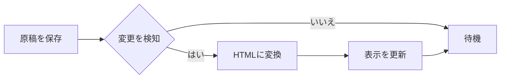
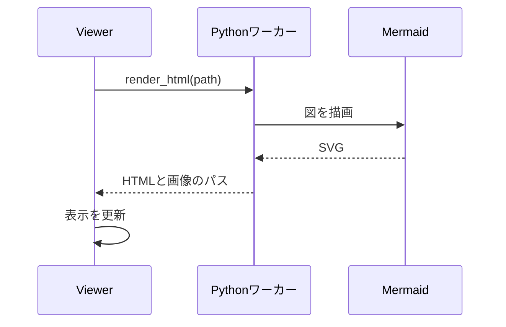
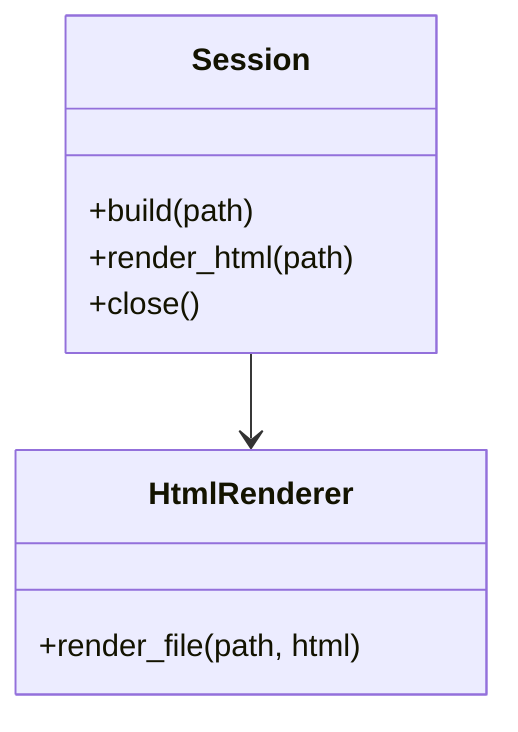

# 計測用の文書（HTML表示の候補の比較）

この文書は、Markdown Viewerの表示方法（#180）を、同じ条件で比較するための固定の原稿です。実際のREADMEや仕様書に近い構成（見出し、表、コード、図、alert、色付きの文字）を含みます。`make_fixture.py`が、HTMLと図の画像にします。

## 概要

text-compositorは、複数のテキストから文書を組み上げるツールです。Markdownの変換に加えて、Mermaid・PlantUML・D2・Graphvizなどの**Diagrams as Code**を、図として描画します。[[用語]]のような記法や、赤い文字・小さい文字のような装飾も使えます。

- 単一のMarkdownを、PDFまたはHTMLにできます。
- 図は、生成したSVGをキャッシュして再利用します。
- 警告とエラーは、原稿の行つきで返します。
- Pythonの常駐ワーカーが、ビルドのあいだ、Mermaidのブラウザを使い回します。

> [!NOTE]
> 計測では、この文書を全候補に同じ内容で表示させます。表示の忠実度も、この文書で確認します。

> [!WARNING]
> 生のHTMLは、PDFと同じく、捨てて警告します。

## 図

### フローチャート



### シーケンス図



### クラス図



### 図とテキストの2カラム

左側に説明文を置き、右側に図を置きます。2カラムのレイアウトは、CSSの表で近似しています。

- 箇条書き1
- 箇条書き2
- 箇条書き3

```svg
<svg xmlns="http://www.w3.org/2000/svg" viewBox="0 0 240 140"><rect width="240" height="140" fill="#e8f0fe"/><circle cx="70" cy="70" r="40" fill="#4285f4"/><rect x="130" y="30" width="80" height="80" rx="8" fill="#fbbc04"/><text x="120" y="130" font-size="12" text-anchor="middle" fill="#333">svgフェンス</text></svg>
```

## 表

| 候補 | 起動 | メモリ | 表示の忠実度 | 備考 |
| :-- | --: | --: | :-: | :-- |
| WebView2（標準） | 未計測 | 未計測 | 高い | Windows専用 |
| WebView2（調整版） | 未計測 | 未計測 | 高い | ブラウザ引数で調整 |
| Tauri（wry） | 未計測 | 未計測 | 高い | Rust |
| ブラウザ＋ローカルサーバ | 未計測 | 未計測 | 高い | 専用ウィンドウではない |
| 軽量HTMLエンジン | 未計測 | 未計測 | 未確認 | JSなし |
| Electron | 未計測 | 未計測 | 高い | 基準 |

| 層 | 状態 | 説明 |
| :-- | :-: | :-- |
| Harness | 実装済み | 常駐ワーカーとJSON行の通信 |
| Loop | 検討中 | ファイル監視と自動更新 |
| Render | 未着手 | 表示方法の決定待ち |

## コード

```python
from text_compositor import Session

with Session() as session:
    result = session.render_html("doc.md")
    if result.ok:
        print(result.html_path)
    for d in result.diagnostics:
        print(d.severity, d.message, d.file, d.line)
```

```bash
python -m text_compositor.worker
```

```yaml
document:
  title: 仕様書
  toc: true
plugins:
  mermaid: true
  plantuml: false
```

## 本文（長めの文章）

Markdown Viewerに求められるのは、余計な機能を持たずに、原稿を素早く読めることです。エディタ機能はなく、ファイルを保存して再読み込みすると、表示が更新されます。既存の汎用Markdown Viewerには、Diagrams as Codeの図を描画できるものが見当たらないため、text-compositorの中核を使って、図つきのMarkdownを表示できるViewerを作ります。

表示の方法は、軽さ、安定性、見た目、実装の手間で比較します。Electronのように重いものが多いため、起動時間、メモリ、プロセス数、配布サイズを、実測で確認します。WebView2は、標準の使い方では重い印象がありますが、起動方法を調整すると軽くなる可能性もあります。

原稿の変更を検知して、表示を自動で更新する機能は、別のissueで扱います。ここでは、ファイルを書き換えて再読み込みするまでの時間だけを測ります。図の生成には、Mermaidのブラウザ、PlantUMLのJava、D2のバイナリが要りますが、生成済みのSVGを表示するだけなら、表示側にJavaScriptは要りません。

長い文書でも、スクロールが滑らかで、再読み込みのときに位置が飛ばないことが望まれます。この文書は、計測のために、ある程度の長さを持たせています。以下の段落は、文字数を増やすための、同じ内容の繰り返しです。

Markdown Viewerに求められるのは、余計な機能を持たずに、原稿を素早く読めることです。エディタ機能はなく、ファイルを保存して再読み込みすると、表示が更新されます。既存の汎用Markdown Viewerには、Diagrams as Codeの図を描画できるものが見当たらないため、text-compositorの中核を使って、図つきのMarkdownを表示できるViewerを作ります。

表示の方法は、軽さ、安定性、見た目、実装の手間で比較します。Electronのように重いものが多いため、起動時間、メモリ、プロセス数、配布サイズを、実測で確認します。WebView2は、標準の使い方では重い印象がありますが、起動方法を調整すると軽くなる可能性もあります。

原稿の変更を検知して、表示を自動で更新する機能は、別のissueで扱います。ここでは、ファイルを書き換えて再読み込みするまでの時間だけを測ります。図の生成には、Mermaidのブラウザ、PlantUMLのJava、D2のバイナリが要りますが、生成済みのSVGを表示するだけなら、表示側にJavaScriptは要りません。

## 画像と装飾


青い文字、緑の文字、~~取り消し線~~、`インラインコード`、[リンク](https://example.com)。

1. 順序つきリストの1番目
2. 2番目
   - 入れ子の項目
   - もう一つの項目
3. 3番目

- [x] 完了したタスク
- [ ] 未完了のタスク

---

## 2列の文章

これは2列に分けて表示する文章です。列の分割は、CSSの`column-count`で近似しています。表示側のエンジンが、この指定に対応しているかを確認するための段落です。これは2列に分けて表示する文章です。列の分割は、CSSの`column-count`で近似しています。表示側のエンジンが、この指定に対応しているかを確認するための段落です。

おわり。
