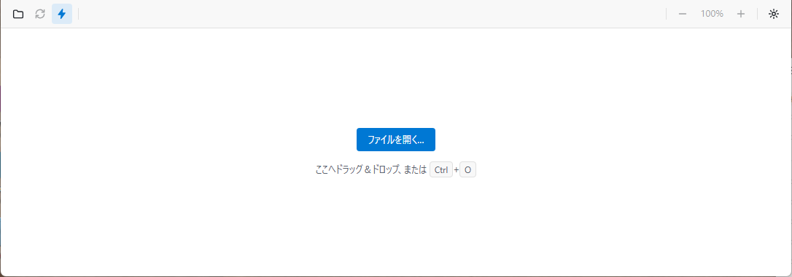

# 入手と起動

## 入手する

GitHubの[Releases](https://github.com/tokudiro/text-compositor/releases)から、最新の版の`Obunzu-<バージョン>-win-x64.zip`をダウンロードします。大きさは、約200 MBです。展開すると、約468 MBになります。

## 起動する

1. ZIPを、好きな場所に展開します（例: `C:\Tools\`）。
2. 展開したフォルダの中の、`obunzu.exe`を起動します。

Pythonなど、ほかのソフトのインストールは、要りません。Obunzuに必要なものは、すべて、そのフォルダの中に入っています。インストーラは、ありません。レジストリにも、書き込みません。

ファイルを指定して、起動することもできます。

```text
obunzu.exe C:\docs\memo.md
```

Obunzuがすでに起動しているときに、別のファイルを開くと、既存のウィンドウで表示します。



## 初回の起動で、Windowsが警告を出すとき

Obunzuには、コード署名をしていません。そのため、Windowsの「SmartScreen」が、初回の起動で、警告を出す場合があります（推測です。この環境では、確認できていません）。警告が出たときは、配布元（上のReleases）から取得したことを確かめてから、実行するかどうかを決めてください。

## 更新する

Obunzuは、自動では更新しません。新しい版が出たときは、新しいZIPを取得して、展開し直します（古いフォルダは、削除して構いません）。セキュリティの修正も、新しい版として出すため、最新の版を使ってください。

設定とキャッシュは、フォルダの外に保存されるため、展開し直しても、引き継がれます（「設定」の章）。

## 削除する

展開したフォルダを、削除します。次のフォルダは、Obunzuを使ったときに作られ、フォルダを削除しても残ります。不要であれば、あわせて削除してください。

| 場所 | 中身 |
| --- | --- |
| `%APPDATA%\Obunzu` | 設定（`settings.json`） |
| `%LOCALAPPDATA%\text-compositor\Cache` | 変換したHTMLと図のキャッシュ、初回に取得したツール（下の表） |

## 初回に取得するもの

Obunzuは、次の図を初めて描くときに、必要なものを、インターネットから取得します。取得したものは、上の`Cache`に保存し、2回目以降は、取得しません。取得には、インターネットへの接続が要ります。

| 図 | 取得するもの | 大きさの目安 |
| --- | --- | --- |
| `mermaid` | Mermaidのスクリプト | 約3.4 MB |
| `plantuml` | PlantUML本体。システムにJava（11以上）がなければ、Javaも | 約17 MB（Javaは、さらに約49 MB） |
| `d2` | D2のプログラム。システムに`d2`がなければ | 約13 MB |

取得には、数秒から数十秒かかります（回線によります）。取得したファイルは、正しいものかを、確かめてから使います。`dot`・`graphviz`・`pikchr`・`cetz`・`fletcher`・`svg`と、ふつうの文章は、取得なしで、すぐに使えます。
