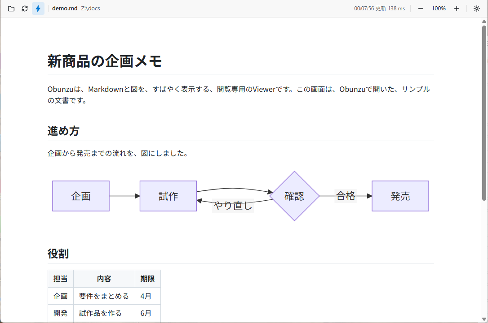
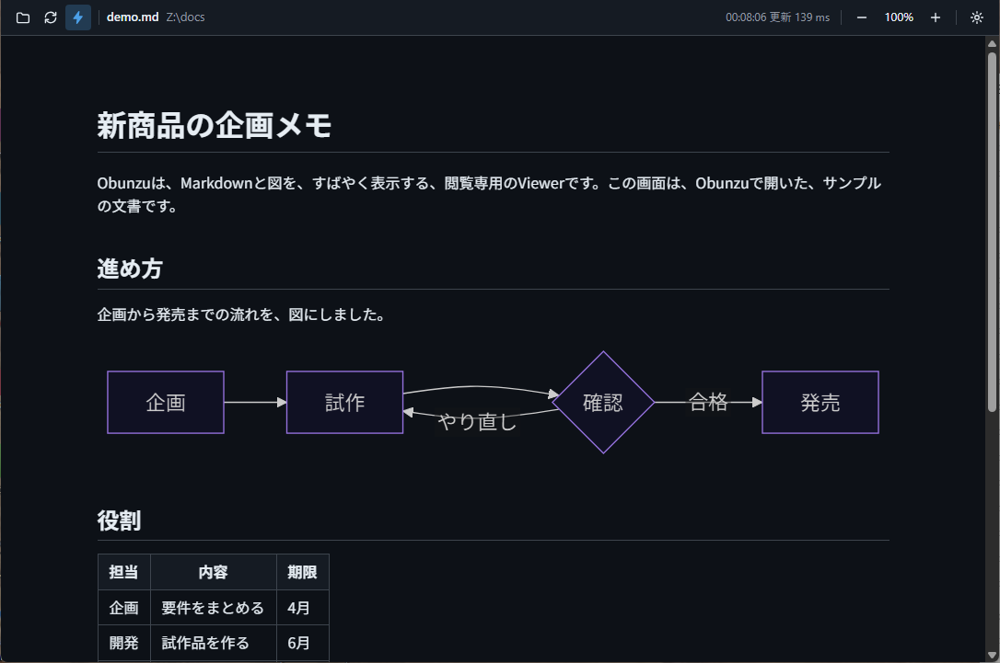

# 画面の見方と操作

## ツールバー

画面の上（設定で、下にもできます）に、ツールバーがあります。左から順に、次のボタンと表示が並びます。

| 部品 | 意味 |
| --- | --- |
| フォルダのボタン | ファイルを開きます（`Ctrl+O`） |
| 回転する矢印のボタン | もう一度、変換します（`F5`・`Ctrl+R`）。ファイルを開いていないときは、押せません |
| 稲妻のボタン | 「保存したら自動で更新」の、オン・オフ。オンのとき、色が付きます |
| 表のボタン | CSVを開いているときだけ、出ます。1行目を、見出しにするかを、切り替えます |
| ファイル名と、フォルダ | 開いているファイル |
| 「変換中…」 | 変換している間だけ、出ます |
| 更新した時刻と、かかった時間 | 例: `00:02:58 更新 207 ms` |
| `−`・拡大率・`＋` | 縮小・拡大。拡大率を押すと、実寸（100%）に戻ります |
| 歯車のボタン | 設定を開きます（`Ctrl+,`） |

ボタンに、マウスを重ねると、名前とショートカットキーが出ます。

## ショートカットキー

| 操作 | キー |
| --- | --- |
| ファイルを開く | `Ctrl+O` |
| もう一度、変換する | `F5`・`Ctrl+R` |
| 拡大 | `Ctrl`＋`+`、または`Ctrl`＋マウスホイール |
| 縮小 | `Ctrl`＋`-`、または`Ctrl`＋マウスホイール |
| 実寸に戻す | `Ctrl+0` |
| 設定を開く・閉じる | `Ctrl+,`（閉じるのは、`Esc`も使えます） |
| 終了 | `Ctrl+Q` |

メニュー（「ファイル」「表示」）からも、同じ操作ができます。メニューは、ふだんは隠れています。`Alt`キーを押すと、出ます。

## 自動で更新

開いているファイルと、そのファイルが参照する画像を保存すると、表示が自動で更新されます。保存から、約0.2秒後です。スクロールの位置は、保たれます。

- お使いのエディタで書きながら、Obunzuを、横に並べて使えます。
- まだ存在しない画像（あとから作る画像）も、作られた時点で、更新します。
- 変換に失敗しても、直前の表示が残り、監視は続きます。原稿を直して保存すると、自動で回復します。
- 稲妻のボタンで、オフにできます。オフにしたときは、`F5`で、変換し直します。

## CSVの見出し

`.csv`を開いているときだけ、ツールバーに、表のボタンが出ます。オンのときは、1行目を見出しにします。オフのときは、すべてをデータの行にします。切り替えは、覚えておきます。

## ダークの配色

配色は、設定で、「OSに合わせる」「ライト」「ダーク」から選びます。

## ウィンドウの大きさ

ウィンドウの大きさ・位置（最大化の状態も）は、記憶し、次の起動で、戻します。外付けの画面を外したあとなど、保存した位置が、今のどの画面にも収まらないときは、大きさだけを戻します。
