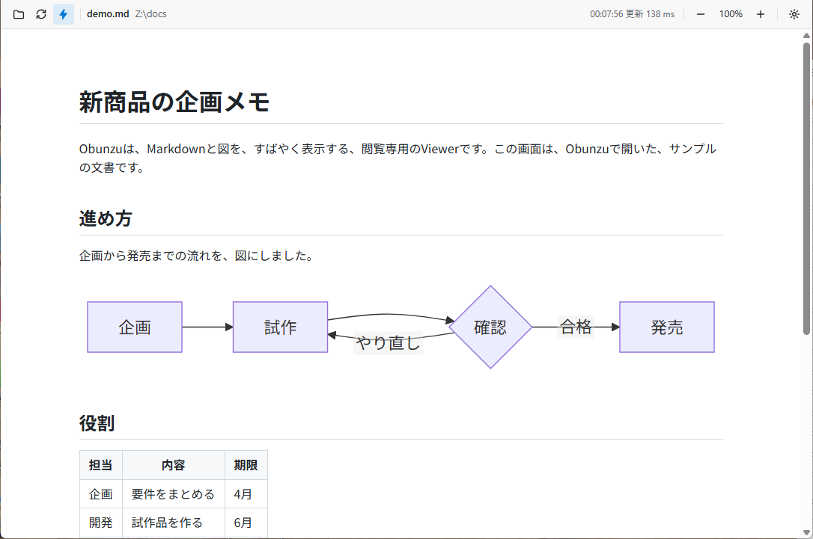
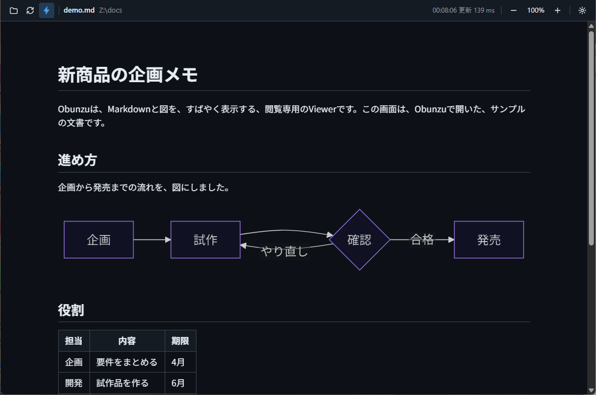

# 画面の見方と操作

## ツールバー

画面の上（設定で、下にもできます）に、ツールバーがあります。左から順に、次のボタンと表示が並びます。

| 部品 | 意味 |
| --- | --- |
| 左の枠のボタン | サイドバー（ファイルツリー）を、開閉します（`Ctrl+B`）。設定で「サイドバー」を「出さない」にすると、出ません |
| フォルダのボタン | ファイルを開きます（`Ctrl+O`） |
| 回転する矢印のボタン | もう一度、変換します（`F5`・`Ctrl+R`）。ファイルを開いていないときは、押せません |
| 稲妻のボタン | 「保存したら自動で更新」の、オン・オフ。オンのとき、色が付きます |
| 表のボタン | CSVを開いているときだけ、出ます。1行目を、見出しにするかを、切り替えます |
| ファイル名と、フォルダ | 開いているファイル |
| 「変換中…」 | 変換している間だけ、出ます |
| 更新した時刻と、かかった時間 | 例: `00:02:58 更新 207 ms` |
| `−`・拡大率・`＋` | 縮小・拡大。拡大率を押すと、実寸（100%）に戻ります |
| 歯車のボタン | 設定を開きます（`Ctrl+,`） |

ボタンに、マウスを重ねると、名前とショートカットキーが出ます。

## ショートカットキー

| 操作 | キー |
| --- | --- |
| ファイルを開く | `Ctrl+O` |
| もう一度、変換する | `F5`・`Ctrl+R` |
| 前の文書へ戻る・進む | `Alt+←`・`Alt+→`（ツールバーの「戻る」「進む」のボタンでも、できます）。文書の中のリンクをたどったあとや、別のファイルを開いたあとに、使えます。前のスクロール位置に戻ります |
| 文書の中を検索する | `Ctrl+F`（閉じるのは、`Esc`）。一致した所は黄色、今の一致はオレンジで示し、件数を出します。`Enter`・`Shift+Enter`で、次・前の一致へ移ります。正規表現・大文字小文字の区別も、切り替えられます |
| 拡大 | `Ctrl`＋`+`、または`Ctrl`＋マウスホイール |
| 縮小 | `Ctrl`＋`-`、または`Ctrl`＋マウスホイール |
| 実寸に戻す | `Ctrl+0` |
| 選択した文字をコピーする・文書全体を選ぶ | `Ctrl+C`・`Ctrl+A`（右クリックのメニューからも、できます） |
| サイドバーを開閉する | `Ctrl+B` |
| 設定を開く・閉じる | `Ctrl+,`（閉じるのは、`Esc`も使えます） |
| ツールバーと文書の間を行き来する | `F6`（キーボードだけで、ツールバーのボタンに届きます） |
| 終了 | `Ctrl+Q` |

メニュー（「ファイル」「表示」）からも、同じ操作ができます。メニューは、ふだんは隠れています。`Alt`キーを押すと、出ます。

## タブ

設定で「複数のタブ」を「使う」にすると、複数の文書を、タブで切り替えて開けます。

| 操作 | 方法 |
| --- | --- |
| 新しいタブで開く | `Ctrl+Shift+O`、またはタブ列の右端の「＋」。いまの文書は、そのまま残ります。`Ctrl`キーを押しながら、ファイルをドロップしても、新しいタブで開きます |
| 切り替える | タブを押す、または`Ctrl+Tab`（次）・`Ctrl+Shift+Tab`（前） |
| 閉じる | `Ctrl+W`、タブ列の右端にある「×」（見ているタブを閉じます）、またはタブの中ボタン（ホイール）クリック。最後の1つは、閉じられません |

- タブ列は、タブが2つ以上あるときだけ出ます。
- スクロールの位置・検索・戻る進む・保存したときの自動更新は、タブごとに保たれます。見ていないタブの原稿を保存しても、そのタブが、自動で更新されます。
- 変換を行うPythonは、全タブで1つです。片方のタブで、時間のかかる図を変換している間は、もう片方の変換も待ちます。
- 「複数のタブ」を「使わない」に戻すと、いま見ているタブだけを残して、ほかは閉じます。

## ファイルツリー

複数のファイルで組んだ文書（`doc/usage/`のようなフォルダ）を、サイドバーのツリーから、素早く切り替えて読めます。

1. メニューの「ファイル」→「フォルダを開く…」、またはサイドバーの上にあるフォルダのボタンで、フォルダを選びます。サイドバーが開き、フォルダの中身が、ツリーで出ます。
2. ツリーのファイルを押すと、いまのタブで開きます。開いているファイルには、色が付きます。
3. フォルダを押すと、開閉します。中身は、開いたときに、読み込みます。

- 出るのは、Obunzuで開けるファイル（Markdown・Text・CSV・図・設定ファイル・ソースコード）だけです。`.`で始まるフォルダ、`node_modules`、`.text-compositor`は、出しません。
- ファイルを1つだけ開いたときは、サイドバーは閉じています（`Ctrl+B`で開いても、案内が出るだけです）。
- フォルダの中のファイルを開いても、サイドバーは、そのままです。フォルダの外のファイルを開くと、ツリーを手放し、サイドバーを閉じます。
- キーボードでも使えます。`↑`・`↓`で動き、`→`でフォルダを開き、`←`で閉じ、`Enter`で開きます。
- 開いたフォルダは、覚えません。次の起動では、もう一度、選びます。サイドバーの開閉も、覚えません（起動直後は、閉じています）。
- 数千のファイルがあるフォルダでも、すぐ開きます（5000ファイルで、展開に約0.2秒）。ネットワークドライブなど、読みの遅い場所は、測っていません。

## 章の一覧（プロジェクト）

text-compositorの設定ファイル（`chapters`に章を並べたもの）を開くと、サイドバーに、章の一覧が出ます。章は、設定に書いた順序で並びます。ファイル名の順とは、限りません。

1. メニューの「ファイル」→「ファイルを開く…」（`Ctrl+O`）で、`text-compositor.config.yaml`（または`text-compositor.config.json`）を選びます。ドラッグ＆ドロップや、起動時の引数でも、同じです。
2. サイドバーが開き、章の一覧が出ます。見出し（`section`）は、章を持つものが、開いた状態で出ます。
3. 章を押すと、その章のファイルを、いまのタブで開きます。開いている章には、色が付きます。本文に出るのは、押した章のファイルだけです（PDFのように、結合した結果ではありません）。

- 設定ファイルを開いた直後の本文は、設定ファイルのソースです。
- 章のファイルの場所は、設定の`inputs.dir`が基準です（省略時は`inputs`）。
- Obunzuで開けないファイルと、`aggregate`の章は、出ません。書き方の誤った章は、飛ばして、警告の帯に出ます。
- 設定を読めないとき（構文の誤りなど）は、サイドバーを出さず、警告の帯に、理由が出ます。本文には、設定ファイルのソースが出ます。
- 章や設定ファイルの外のファイルを開くと、章の一覧を手放し、サイドバーを閉じます。
- 設定ファイルは、名前で判定します。別の名前の設定ファイルは、ふつうのファイルとして開きます。フォルダのツリーで、設定ファイルを押したときも、ふつうのファイルとして開きます。
- 設定ファイルを保存すると、章の一覧を作り直します（自動更新がオンのとき）。設定を読めない状態で保存したときは、前の一覧のまま残り、直して保存すると、更新されます。
- 設定の「サイドバー」を「出さない」にすると、章の一覧も出ません。

## 文字列をコピーする

文書の中の文字列を選んで、右クリックすると、メニューの先頭に「コピー」が出ます。選択がないときは、「コピー」は出ません。「すべて選択」は、いつでも出て、文書全体を選びます。

- キーボードでは、`Ctrl+C`（コピー）・`Ctrl+A`（すべて選択）です。
- 文字だけでなく、表などの形も、コピーされます。貼り付け先によっては、表のまま貼れることがあります。
- 画像・リンク・行番号の項目がある場所では、同じメニューに、区切り線を挟んで、続きます。

## 選択した文字を読み上げる

文字列を選んで、右クリックすると、「選択範囲を読み上げる」が出ます。選択がないときは、出ません。Windowsの標準の音声合成を使うため、追加のインストールは要りません。

- 読み上げ中に右クリックすると、「読み上げを一時停止」（一時停止中は「読み上げを再開」）と「読み上げを止める」が出ます。選択を外していても、出ます。
- 別のファイルを開く・タブやウィンドウを閉じる・アプリを終了すると、読み上げは止まります。
- 声と速さは、設定の「読み上げの声」「読み上げの速さ」で選びます。「試し聞き」のボタンで、確かめられます。
- 選択が長いときは、先頭の2万文字までを読みます。
- Windowsだけの機能です。

## 画像を保存する

図や画像を右クリックすると、保存できます。SVGの図は、「画像（SVG）を保存…」（ベクターのまま）か、「画像（PNG）を保存…」（2倍の大きさのPNG）を選べます。SVG以外の画像は、元の形式のまま保存します。保存のダイアログは、文書のフォルダ、または前回に画像を保存したフォルダから始まります。

## 自動で更新

開いているファイルと、そのファイルが参照する画像を保存すると、表示が自動で更新されます。保存から、約0.2秒後です。スクロールの位置は、保たれます。

- お使いのエディタで書きながら、Obunzuを、横に並べて使えます。
- まだ存在しない画像（あとから作る画像）も、作られた時点で、更新します。
- 変換に失敗しても、直前の表示が残り、監視は続きます。原稿を直して保存すると、自動で回復します。
- 稲妻のボタンで、オフにできます。オフにしたときは、`F5`で、変換し直します。

## CSVの見出し

`.csv`を開いているときだけ、ツールバーに、表のボタンが出ます。オンのときは、1行目を見出しにします。オフのときは、すべてをデータの行にします。切り替えは、覚えておきます。

## ダークの配色

配色は、設定で、「OSに合わせる」「ライト」「ダーク」から選びます。

## ウィンドウの大きさ

ウィンドウの大きさ・位置（最大化の状態も）は、記憶し、次の起動で、戻します。外付けの画面を外したあとなど、保存した位置が、今のどの画面にも収まらないときは、大きさだけを戻します。
