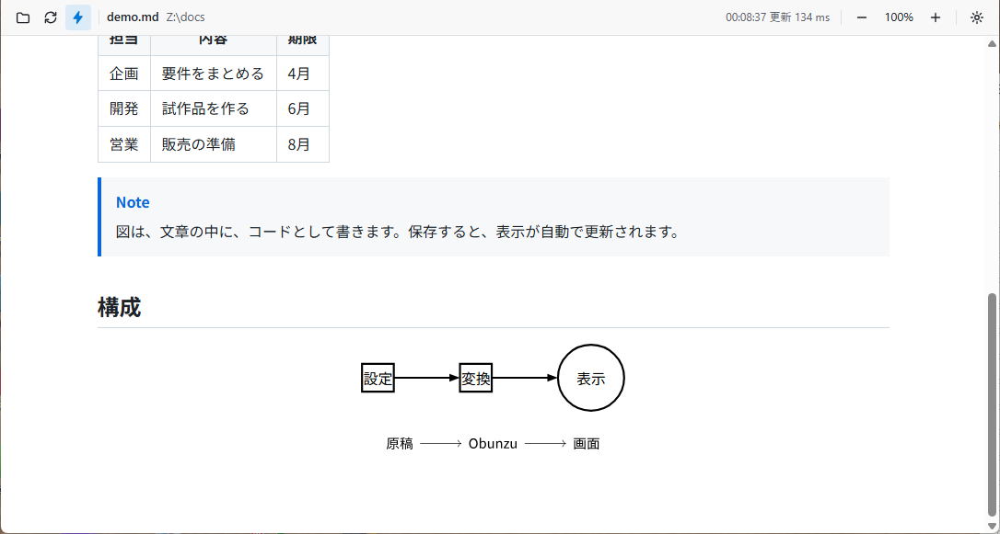
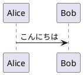
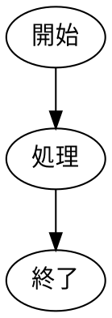

# 図を書く

図は、文書の中に、コードとして書きます。Markdownの、コードブロックの言語名に、図の種類を書くと、Obunzuが、絵にして表示します。



## 対応する図

| 言語名 | 図の種類 | 初回に取得が要るか |
| --- | --- | --- |
| `mermaid` | フローチャート・シーケンス図など | 要ります（約3.4 MB） |
| `plantuml` | UMLの図 | 要ります（約17 MB。Javaがなければ、さらに約49 MB） |
| `d2` | 構成図 | 要ります（約13 MB） |
| `dot`・`graphviz` | ネットワーク・関係の図 | 要りません |
| `pikchr` | 箱と矢印の図（SQLiteの作者が作った、図を文章で書く言語） | 要りません |
| `cetz` | 幾何図形・木構造・グラフ（Typstの描画ライブラリ） | 要りません |
| `fletcher` | ノードと矢印の図（フローチャート・状態遷移図など） | 要りません |
| `svg` | 完成した、SVGの画像 | 要りません |

取得が要る図は、初回だけ、数秒から数十秒かかります。取得の詳細は、「入手と起動」の章にあります。

## 書き方の例

Mermaid:

````markdown

````

PlantUML:

````markdown

````

Graphviz:

````markdown

````

D2:

````markdown
```d2
サーバー -> データベース: 問い合わせ
```
````

Pikchr:

````markdown
```pikchr
box "設定" fit
arrow
box "変換" fit
arrow
circle "表示"
```
````

CeTZ（1行に1つずつ、描画の関数を書きます）:

````markdown
```cetz
circle((0, 0), radius: 1)
line((0, 0), (2, 1))
content((1, 0.5), [日本語のラベル])
```
````

Fletcher（`node(...)`と`edge(...)`を、コンマで区切って書きます）:

````markdown
```fletcher
node((0, 0), [原稿]), edge("->"), node((1, 0), [Obunzu])
```
````

## 図の大きさ

図の後ろに、`{width=...}`・`{height=...}`を書くと、大きさを指定できます。

````markdown

````

指定しないときは、文書の幅に収まる大きさで表示します。

## 図の単体ファイル

図のコードだけを書いたファイル（`.mmd`・`.puml`・`.d2`・`.dot`・`.gv`・`.pikchr`）は、そのまま開いて、図1つとして、表示できます。

## CeTZ・Fletcherの注意

`cetz`・`fletcher`の中には、`import`・`include`と、ファイルを読む関数（`read`など）は、書けません。書くと、エラーになります。原稿が、意図しないファイルを、読まないようにするためです。CeTZ・Fletcherの描画の関数は、最初から使えます。

## Graphvizの注意

Graphvizは、PDFを作るときと同じ仕組みで、描きます。そのため、次の書き方は、描けないか、見た目が変わります。データ構造の図（`shape=record`）と、図全体のタイトル（`label`）は、警告を出します。

## 図が描かれないとき

- 言語名の綴りを、確かめてください。未知の言語名のコードブロックは、ふつうのコードとして、表示します。
- 図の、コードの誤りは、エラーの帯に、原稿の行つきで出ます（「エラーが出たとき」の章）。
- Obunzuでは、すべての図が、有効です（text-compositorの設定の、`plugins`は、Obunzuには、効きません）。
