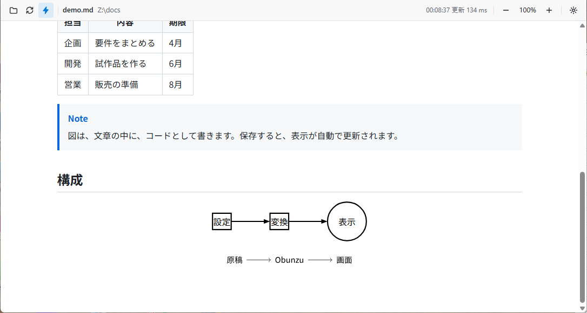
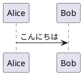
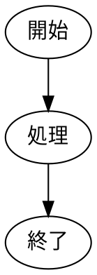

# 図を書く

図は、文書の中に、コードとして書きます。Markdownの、コードブロックの言語名に、図の種類を書くと、Obunzuが、絵にして表示します。



## 対応する図

| 言語名 | 図の種類 | 初回に取得が要るか |
| --- | --- | --- |
| `mermaid` | フローチャート・シーケンス図など | 要りません（`mermaid.min.js`を同梱） |
| `plantuml` | UMLの図 | 要りません（Java・plantuml.jarを同梱） |
| `d2` | 構成図 | 要りません（D2本体を同梱） |
| `structurizr` | C4モデルの図（ソフトウェア構成） | 要りません（Java・structurizr-cliを同梱。下の「Structurizrの注意」） |
| `dot`・`graphviz` | ネットワーク・関係の図 | 要りません |
| `pikchr` | 箱と矢印の図（SQLiteの作者が作った、図を文章で書く言語） | 要りません |
| `cetz` | 幾何図形・木構造・グラフ（Typstの描画ライブラリ） | 要りません |
| `fletcher` | ノードと矢印の図（フローチャート・状態遷移図など） | 要りません |
| `timeliney` | ガントチャート（Typstの描画ライブラリ） | 要りません |
| `finite` | 有限オートマトンの図（状態遷移図。受理状態は二重丸。Typstの描画ライブラリ） | 要りません |
| `vega-lite`・`vega` | 棒・折れ線・散布図・ファセット分割などのグラフ（JSONで書く） | 要りません（`vega.min.js`・`vega-lite.min.js`を同梱） |
| `wavedrom` | デジタルのタイミング図（波形図）・レジスタ図（JSONで書く） | 要りません（`wavedrom.min.js`・スキンを同梱） |
| `bytefield` | プロトコルのパケット構造などの、ビット/バイトフィールド図（Clojureの記述で書く） | 要りません（`lib.js`を同梱） |
| `svg` | 完成した、SVGの画像 | 要りません |

どの図も、初回に追加の取得は要りません（「入手と起動」の章）。

## 書き方の例

Mermaid:

````markdown

```mermaid
graph LR
  A[企画] --> B[試作] --> C[発売]
```
````

PlantUML:

````markdown

```plantuml
@startuml
Alice -> Bob: こんにちは
@enduml
```
````

Graphviz:

````markdown

```dot
digraph { 開始 -> 処理 -> 終了 }
```
````

D2:

````markdown
```d2
サーバー -> データベース: 問い合わせ
```
````

Pikchr:

````markdown
```pikchr
box "設定" fit
arrow
box "変換" fit
arrow
circle "表示"
```
````

CeTZ（1行に1つずつ、描画の関数を書きます）:

````markdown
```cetz
circle((0, 0), radius: 1)
line((0, 0), (2, 1))
content((1, 0.5), [日本語のラベル])
```
````

Fletcher（`node(...)`と`edge(...)`を、コンマで区切って書きます）:

````markdown
```fletcher
node((0, 0), [原稿]), edge("->"), node((1, 0), [Obunzu])
```
````

timeliney（`headerline(...)`・`taskgroup(...)`・`task(...)`などを、1行に1つずつ書きます）:

````markdown
```timeliney
headerline(group(([*Q1*], 1), ([*Q2*], 1)))
taskgroup(title: [開発], {
  task("実装", (0, 1))
})
```
````

finite（遷移表を、`automaton(...)`の引数として書きます。`initial:`が開始状態、`final:`が受理状態です）:

````markdown
```finite
(
  q0: (q0: "0", q1: "1"),
  q1: (q2: "0", q0: "1"),
  q2: (q1: "0", q2: "1"),
),
initial: "q0",
final: ("q0",)
```
````

## 図の大きさ

図の後ろに、`{width=...}`・`{height=...}`を書くと、大きさを指定できます。

````markdown

```mermaid {width=50%}
graph LR
  A --> B
```
````

指定しないときは、文書の幅に収まる大きさで表示します。

## 図の単体ファイル

図のコードだけを書いたファイル（`.mmd`・`.puml`・`.d2`・`.dot`・`.gv`・`.pikchr`・`.dsl`）は、そのまま開いて、図1つとして、表示できます。

## Structurizrの注意

`structurizr`は、text-compositor本体（PDF）では既定で無効（内部で使う`structurizr-cli`が約99 MBあるため）で、使うには`plugins: { structurizr: true }`と明示する必要があります。**Obunzuでは、Java・structurizr-cliを同梱しているため、常に有効です。** 明示の指定は要りません。

1つのワークスペースが定義できるビューは、1フェンスにつき1つだけです。`structurizr-cli`は、ワークスペースが定義するビューの数だけファイルを分けて書き出す仕様で、こちらから1つだけ選ぶ方法がありません。2つ以上のビュー（`systemContext`と`container`を両方書く等）を定義すると、エラーになります。System ContextとContainerの両方を見せたい場合は、フェンスを2つに分け、共通のモデル定義はDSLの`!include`で別ファイルに切り出してください。

## CeTZ・Fletcher・timeliney・finiteの注意

`cetz`・`fletcher`・`timeliney`・`finite`の中には、`import`・`include`と、ファイルを読む関数（`read`など）は、書けません。書くと、エラーになります。原稿が、意図しないファイルを、読まないようにするためです。CeTZ・Fletcher・timelineyの描画の関数は、最初から使えます。

`timeliney`は、他の図と違い、既定で行の幅いっぱいに描かれます（`{width=...}`を指定しなければ、行の幅を超えたときだけ縮小する、という動作にはなりません）。

`finite`は、状態や遷移が増えると、遷移のラベルが重なって、読めなくなることがあります。配置は、`layout: layout.circular`のように、引数で変えられます（図によって、向き不向きがあります）。初期状態の矢印の文字は、「Start」です。

## Graphvizの注意

Graphvizは、PDFを作るときと同じ仕組みで、描きます。そのため、次の書き方は、描けないか、見た目が変わります。データ構造の図（`shape=record`）と、図全体のタイトル（`label`）は、警告を出します。

## 図が描かれないとき

- 言語名の綴りを、確かめてください。未知の言語名のコードブロックは、ふつうのコードとして、表示します。
- 図の、コードの誤りは、エラーの帯に、原稿の行つきで出ます（「エラーが出たとき」の章）。
- Obunzuでは、`structurizr`を含め、すべての図が、有効です（text-compositorの設定の、`plugins`は、Obunzuには、効きません）。
