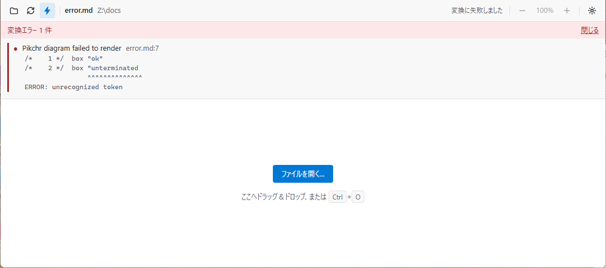

# エラーが出たとき

変換に失敗したときは、画面の上（設定で、下にもできます）に、赤い帯が出ます。

## 帯と詳細

- **帯**: 「変換エラー 1 件」のように、1行の要約が出ます。帯を押すと、詳細を、閉じる・開くができます。
- **詳細**: 項目ごとに、何が失敗したか、原稿の行（分かる場合）、ツールの出力を示します。上の例は、原稿の7行目にある、Pikchrの図の、文字列が閉じられていない誤りです。Pikchr自身の説明（該当の行・位置・原因）が出ます。
- 新しいエラーが出たときは、詳細も、自動で開きます。
- エラーは赤、警告は黄色の印と線で、区別します。

## 直前の表示は残る

変換に失敗しても、直前に成功した表示は、残ります。原稿を直して保存すれば、自動で、表示が更新され、エラーの帯は、消えます（自動更新がオフのときは、`F5`）。

ただし、ファイルを開いて、最初の変換で失敗したときは、表示できる文書がないため、案内の画面のままです。

## 警告

警告は、変換を続けたうえで、注意を促します。たとえば、次のときです。

- 画像が見つからないとき（PDFと違い、Obunzuは、ほかの部分を、表示します）。
- 生のHTMLが含まれていて、無視したとき。
- Graphvizの、描けない書き方（`shape=record`・図全体の`label`）があるとき。

## 図のエラー

図のコードに誤りがあると、その図の種類の名前と、失敗の内容が、帯に出ます。原稿の行が分かるときは、その行も、示します。

| 図 | エラーの内容 |
| --- | --- |
| Mermaid | Mermaid自身の、構文エラー（何行目の、何が誤りか） |
| Graphviz | 構文エラーの行 |
| Pikchr | Pikchr自身の説明（行・位置・原因） |
| CeTZ・Fletcher | Typstのメッセージ。行は、コードブロックの、開始の行を示します。`import`だけは、その行を示します |

図が複数あるときは、最初のエラーで、止まります。直すと、次の図のエラーが、出ることがあります。
