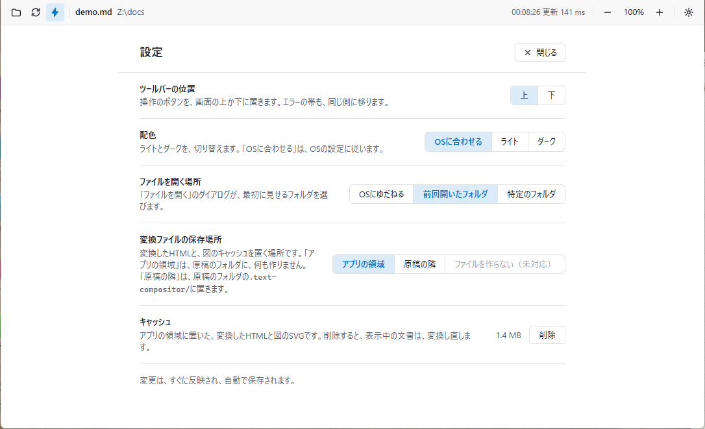

# 設定

ツールバーの、歯車のボタン（または`Ctrl+,`）で、設定の画面を開きます。「閉じる」のボタン・`Esc`・歯車のボタンで、閉じます。ファイルを開く・再読み込みでも、閉じます。

変更は、すぐに反映され、自動で保存されます。

| 項目 | 選択肢 | 説明 |
| --- | --- | --- |
| ツールバーの位置 | 上・下 | ボタンを、画面の上か下に置きます。エラーの帯も、同じ側に移ります |
| 配色 | OSに合わせる・ライト・ダーク | 「OSに合わせる」は、OSの設定に従います |
| ファイルを開く場所 | OSにゆだねる・前回開いたフォルダ・特定のフォルダ | 「ファイルを開く」のダイアログが、最初に見せるフォルダです。「特定のフォルダ」を選ぶと、「フォルダを選ぶ…」のボタンが出ます |
| 変換ファイルの保存場所 | アプリの領域・原稿の隣 | 変換したHTMLと、図のキャッシュを置く場所です |
| キャッシュ | 削除のボタン | アプリの領域の、使用量を表示します |

「ファイルを開く場所」の、既定は、「前回開いたフォルダ」です。前回開いたフォルダ・特定のフォルダが、未設定か、なくなっているときは、ドキュメントのフォルダから始まります。

「自動で更新」のオン・オフ（稲妻のボタン）と、CSVの見出しの切り替えも、覚えておきます。

## 変換ファイルの保存場所

- **アプリの領域**（既定）: 変換したHTMLと、図のキャッシュを、アプリのキャッシュのフォルダ（`%LOCALAPPDATA%\text-compositor\Cache\viewer`）に置きます。原稿のフォルダには、何も書きません。読み取り専用の場所の原稿も、開けます。
- **原稿の隣**: 原稿の隣の、`.text-compositor/`のフォルダに置きます。書き込めない場所の原稿は、「原稿の隣」を選んでいても、アプリの領域に置いて開き、警告を出します。
- 「ファイルを作らない」は、まだ実装しておらず、選べません。

## キャッシュの削除

「削除」を押すと、アプリの領域に置いた、変換したHTMLと図のキャッシュを、削除します。開いている文書は、変換し直します。原稿の隣の`.text-compositor/`と、初回に取得したツール（Mermaid・PlantUML・D2など）は、削除しません。

## 設定の保存先

設定は、`%APPDATA%\Obunzu`の`settings.json`に、保存します。ファイルがない・壊れている・値が想定外のときは、既定値に戻ります。起動は、止まりません。設定を、初期の状態に戻したいときは、Obunzuを終了して、このファイルを削除してください。
