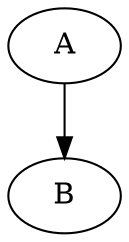
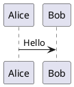

# 図表（Mermaid / Graphviz / PlantUML / D2 / Structurizr / Pikchr / CeTZ / Fletcher / SVG）

通常のフェンスコードブロックとして書きます。

````markdown






```d2
A -> B
```

```structurizr
workspace {
    model {
        user = person "User"
        softwareSystem = softwareSystem "Software System"
        user -> softwareSystem "Uses"
    }
    views {
        systemContext softwareSystem "SystemContext" {
            include *
            autoLayout
        }
    }
}
```

```pikchr
box "開始" fit; arrow; circle "終了"
```

```svg
<svg xmlns="http://www.w3.org/2000/svg" width="200" height="100">
  <rect x="10" y="10" width="180" height="80" fill="lightblue"/>
</svg>
```
````

`plugins:` で無効化していない限り自動でレンダリングされます（`graphviz`/`mermaid`/`plantuml`/`d2`/`pikchr`/`cetz`/`fletcher`とも既定`true`）。**`structurizr`だけは既定`false`です。** 使うには`plugins: { structurizr: true }`と明示する必要があります（内部で使う`structurizr-cli`一式が約99MBあるため）。図をテキストと横並びにしたい場合や、2つの図を比較したい場合は独自のレイアウト記法が使えます。

### 記法ごとの対応

| フェンス | 種別 | Obunzu（HTML出力）での扱い |
| --- | --- | --- |
| `mermaid` |   | ElectronのChromiumで描画します |
| `plantuml` |   | PDF出力と同じ仕組みで、SVGにします |
| `d2` |   | PDF出力と同じ仕組みで、SVGにします |
| `structurizr` |   | PDF出力と同じ仕組みで、SVGにします（`structurizr-cli`でPlantUMLへ書き出してから描画）。既定は無効です（下の「Structurizr固有の注意点」） |
| `svg` |   | そのまま画像として表示します |
| `dot` / `graphviz` |   | PDF出力と同じ仕組み（Typstの`diagraph`）で、SVGにします。PDF出力と、同じ図になります。使えない記法があります（下の「Graphvizで使えない記法」） |
| `pikchr` |   | PDF出力と同じ仕組み（Typstの`kip`。PikchrのWASM版）で、SVGにします。PDF出力と、同じ図になります。構文エラーは、Pikchr自身の説明（行・位置・原因）つきで示します |
| `cetz` / `fletcher` |   | PDF出力と同じ仕組み（Typstの`cetz`・`fletcher`）で、SVGにします。PDF出力と、同じ図になります。`import`・ファイルを読む関数は、使えません（下の「CeTZ・Fletcherについて」） |

### Graphvizで使えない記法

Graphvizは、PDF出力・Obunzu・Python APIのすべてで、Typstの`diagraph`で描きます。次の記法は、描けないか、見た目が変わります。

| 使えないもの | 何が起きるか |
| --- | --- |
| データ構造の図（`shape=record`・`Mrecord`） | 仕切りの記号（`{名前\|年齢}`など）が、そのまま文字で、1つの箱に出ます。Obunzu・Python APIでは、警告を出します（PDF出力は、警告なし） |
| 図全体のタイトル（`label="…"`・`labelloc`） | 表示されません。Obunzu・Python APIでは、警告を出します（PDF出力は、警告なし）。タイトルは、Markdownの本文に書くか、`cluster`の`label`（描けます）にしてください |
| 表を使ったラベル（HTMLラベル） | 文字が、セルからはみ出す場合があります（警告なし） |
| ラテン文字のノード名（`a`・`b`など） | 斜体の明朝系の字体になります。日本語のラベルは、普通の字体です（警告なし） |

警告は、DOTを簡易に調べて出します。ノードの`label`や`cluster`の`label`は、描けるため、警告しません。

### Pikchrについて

Pikchr（SQLiteの作者が作った、図を文章で書く言語。[公式](https://pikchr.org/)）は、`box`・`arrow`・`circle`などを並べて、図を書きます。

```pikchr
box "設定" fit
arrow
box "変換" fit
arrow
circle "PDF"
```

- 日本語のラベルも、使えます。`{width=...}`/`{height=...}`で、大きさを指定できます（下の「サイズ指定」）。
- 構文エラーがあると、ビルドは失敗し、Pikchr自身の説明（該当の行・位置・原因）が出ます。行は、原稿の行です。
- `.pikchr`ファイルも、`chapters`に指定できます（1ファイル＝1章）。Obunzuでも、単体のファイルとして開けます。
- PDF出力もObunzuも、同梱のPikchrのWASM版（Typstの`kip`）で描くため、同じ図になります。`plugins.pikchr: false`で、無効にできます。
- Pikchrの記法は、[公式のドキュメント](https://pikchr.org/home/doc/trunk/doc/userman.md)を参照してください。

### CeTZ・Fletcherについて

`cetz`・`fletcher`は、Typstの描画ライブラリで、図を描きます。幾何図形・木構造・グラフは、CeTZ（[公式](https://typst.app/universe/package/cetz)）が得意です。ノードと矢印の図（フローチャート・状態遷移図・可換図式）は、Fletcher（[公式](https://typst.app/universe/package/fletcher)）が得意です。

`cetz`には、CeTZの描画関数（`circle`・`line`・`content`など）を、1行に1つずつ書きます。

````markdown
```cetz
circle((0, 0), radius: 1)
line((0, 0), (2, 1))
content((1, 0.5), [日本語のラベル])
```
````

`fletcher`には、`diagram(...)`の引数を、コンマで区切って書きます。

````markdown
```fletcher
node((0, 0), [開始]), edge("->"), node((1, 0), [処理]), edge("->"), node((2, 0), [終了])
```
````

- 日本語のラベルも、使えます。`{width=...}`/`{height=...}`で、大きさを指定できます（下の「サイズ指定」）。指定しなければ、行の幅より広いときだけ、縮小します。
- `import`・`include`は、書けません（書くと、原稿の行つきのエラーになります）。CeTZの描画関数は、最初から使えます（`cetz.draw`のすべて。`cetz.vector`・`cetz.tree`などは、`cetz.`をつけて使えます）。Fletcherは、`node`・`edge`・`shapes`（`shapes.diamond`など）・`fletcher`が使えます。
- ファイルを読む関数（`read`・`json`・`csv`など）も、使えません。原稿が、意図しないファイルを、読まないようにするためです。
- Typstの構文や関数名の間違いは、ビルドが失敗し、Typstのメッセージが出ます。行は、フェンスの開始行です（コードの中の位置は、出ません）。
- PDF出力もObunzuも、同梱のTypstのパッケージ（`cetz`・`fletcher`）で描くため、同じ図になります。`plugins.cetz: false`・`plugins.fletcher: false`で、それぞれ無効にできます。
- CeTZは、LGPL-3.0以降のライセンスです。Obunzuには、改造せずに、同梱しています（ライセンスの全文とソースの入手先は、配布物の`licenses/`にあります）。
- 記法は、それぞれの公式のドキュメント（[CeTZ](https://cetz-package.github.io/docs/)・[Fletcher](https://github.com/Jollywatt/typst-fletcher)）を参照してください。

レイアウトのブロック（`::: layout-...`・`::: align`）も、PDF出力とObunzuの両方で使えます。Obunzuでは、CSSで近似するため、見た目が、PDF出力と少し違う場合があります。

`svg`フェンスはMermaid/PlantUML/Graphvizと異なりレンダリングを一切行いません。SVGは既にテキストで完結したベクター画像フォーマットのため、コードの内容をそのまま画像として埋め込みます。外部ツールへの依存が無いため`plugins:`の無効化対象にもなりません（常時有効）。

### 既存のSVGファイルを画像として貼る

 

コードを原稿に直接書くのではなく、すでに手元にある`.svg`ファイルを貼りたい場合は、`svg`フェンスを使わず通常のMarkdown画像記法だけで済みます。TypstがSVGをネイティブにサポートしているため、専用の対応やレンダリングを追加しなくてもそのまま埋め込まれます。

```markdown

```

PNG/JPEGと同じ画像として扱われるため、[Markdown画像の配置・サイズ指定](06_markdown_basics.md)（`alt|width=`/`align=`構文）やレイアウト記法（`layout-right`等）もそのまま使えます。`svg`フェンスとの使い分けは、「別ファイルとして管理された既存のSVGを貼るか」「原稿に直接コードを書くか」です。

## サイズ指定（width/height）

 

図は既定でページ幅・高さの上限（Mermaid/PlantUML/D2は12cm、Graphviz/Pikchr/CeTZ/Fletcherはページ幅）を超えないよう自動縮小されます。ただし、拡大はされません。明示的にサイズを指定したい場合は、言語名の後ろに`{width=...}`/`{height=...}`を書きます。

````markdown


````

- `mermaid`/`plantuml`/`dot`/`graphviz`/`svg`/`d2`/`structurizr`/`pikchr`/`cetz`/`fletcher`のいずれのフェンスでも使えます。`width`/`height`は片方だけでも両方でも指定できます。`cetz`/`fletcher`は、縦横比を保って拡大・縮小し、両方を指定したときは、その枠に収めます。
- 値はTypstがそのまま解釈できる文字列（`50%`、`8cm`等）です。
- 明示指定すると自動縮小は働かなくなり、指定した値がそのまま使われます。**拡大も含めて指定どおりに反映される**ため、ページからはみ出さないかは自分で確認してください。
- 未指定の場合は従来どおり、はみ出さないよう自動で縮小されます（拡大はされません）。
- `layout-right`/`layout-left`/`layout-compare`内の図でも同じ記法が使えます。`layout-feature`内では、Markdown画像は写真用レイアウトの仕様上サイズ指定を無視して常に枠いっぱいに敷き詰められます。一方、Mermaid/PlantUML/Graphviz/D2/Structurizr/Pikchr/CeTZ/Fletcherのフェンスは対象外（このレイアウトの想定用途ではない使い方）のため`{width=...}`/`{height=...}`がそのまま反映されます。

## ローカルにブラウザ／Java／D2が無い場合

MermaidはChrome/Edge、PlantUML・StructurizrはJava（11以上）、D2はD2 CLI本体が必要です。システムに見つからない場合の挙動は`plugins.mermaid_auto_download`/`plugins.plantuml_auto_download`/`plugins.d2_auto_download`/`plugins.structurizr_auto_download`で制御します（「plugins: 図表プラグインの有効・無効」の章）。既定はMermaidがエラー終了、PlantUML・D2・Structurizrが自動取得（それぞれ約50MB・約13MB・Java約50MB+structurizr-cli約99MB）です。**Mermaid側を`true`にすると、Playwright自身のChromium（約700MB）をダウンロードする**点に注意してください。GitHub Actionsの`ubuntu-latest`にはMermaid用のブラウザ・PlantUML/Structurizr用のJavaが標準搭載されているため、CI上では追加取得は発生しません。一方、D2 CLI・structurizr-cliは標準搭載されていないため、初回ビルド時に自動取得されます（`structurizr`は既定無効のため、有効化しない限り取得自体が発生しません）。

## PlantUML固有の注意点

- `@startuml` / `@enduml` を省略せず、実際のPlantUML構文どおりに書いてください（自動補完はしません）。
- レイアウトエンジンには純Java実装の Smetana を使うため、`dot`（Graphviz）等の外部バイナリは不要です。
- `plantuml.jar`（MIT版）は初回ビルド時のみ取得し、OS標準のユーザーキャッシュ領域（Windows: `%LOCALAPPDATA%\text-compositor\Cache`、Linux: `~/.cache/text-compositor`、macOS: `~/Library/Caches/text-compositor`）にキャッシュします。Eclipse Temurin JREを自動取得した場合も同じ領域にキャッシュします。

## D2固有の注意点

- レイアウトエンジンは既定の`dagre`です。PlantUML/Graphvizと異なり、D2の構文自体はコード例のとおり`A -> B`のようにシンプルです（詳しい書き方は[D2公式ドキュメント](https://d2lang.com/)を参照してください）。
- D2公式CLIバイナリ（Go製の単一実行ファイル）は初回ビルド時のみ取得し、PlantUML/Mermaidと同じOS標準のユーザーキャッシュ領域にキャッシュします。システムに`d2`コマンドが既にあればそちらを再利用し、ダウンロードは発生しません。

## Structurizr固有の注意点

- **既定で無効です。** 使うには`plugins: { structurizr: true }`を明示してください（内部で使う`structurizr-cli`一式が約99MBあるため）。
- 中身は、実際のStructurizr DSL構文どおりに書きます（[Structurizr DSL公式ドキュメント](https://docs.structurizr.com/dsl/language)を参照）。新しい描画コードは持たず、公式`structurizr-cli`でPlantUMLへ書き出し、PlantUMLと同じパイプラインで描画するだけです。
- **1つのワークスペースが定義できるビューは、1フェンスにつき1つだけです。** `structurizr-cli`は、ワークスペースが定義するビューの数だけファイルを分けて書き出す仕様で、こちらから1つだけ選ぶ方法がありません。2つ以上のビュー（`systemContext`と`container`を両方書く等）を定義すると、エラーで終了します。System ContextとContainerの両方を見せたい場合は、フェンスを2つに分け、共通のモデル定義はDSLの`!include`で別ファイルに切り出してください。
- `plugins.structurizr_auto_download`（既定`true`）で、Java・`structurizr-cli`一式の自動取得を制御します。`plugins.plantuml_auto_download`とは別の設定です（Structurizrを使うプロジェクトが、常にPlantUMLのフェンスも使うとは限らないため）。`plantuml.jar`自体は、`plugins.plantuml`の値に関わらず、内部実装として常に取得されます。

````markdown
::: layout-right
左にこのテキスト、右に図が並びます。


:::
````

`::: layout-right`/`::: layout-compare`の中に置ける図は、Mermaidに限らずPlantUML・Graphviz（`dot`/`graphviz`フェンス）・D2（`d2`フェンス）・Structurizr（`structurizr`フェンス）・Pikchr・CeTZ・Fletcher・SVG（`svg`フェンス）・Markdown画像（``、単独行のみ）のいずれも使えます。`::: layout-compare ... :::` は2つの図を左右に並べます（横長の図には不向き）。2つの種類を混在させる（例: 片方はMermaid図、もう片方は写真）こともできます。

図を左・テキストを右に置きたい場合は`layout-right`の左右反転版`layout-left`が使えます。中に置ける図の種類・書式は`layout-right`と同じです。

````markdown
::: layout-left
左に図、右にこのテキストが並びます。


:::
````

左右の比率を変えたい場合は、ブロック名の後ろに`{left=... right=...}`を付けます（例: `layout-right {left=30 right=70}`）。省略時は`layout-right`がテキスト35:図65、`layout-left`が図65:テキスト35です。数字は比率として扱われるだけなので、合計が100である必要はありません（`{left=3 right=7}`と`{left=30 right=70}`は同じ見た目になります）。片方だけ指定した場合、もう片方は省略時の既定値のままです。

````markdown
::: layout-right {left=30 right=70}
テキストを控えめに、図を広めに配置します。


:::
````

````markdown
::: layout-compare


:::
````

## layout-feature: 写真メイン＋キャッチコピー

 

写真（または図）をフルブリードで敷き、下部に半透明の帯とキャッチコピーを重ねるレイアウトです。表紙・扉スライドなどで使います。

````markdown
::: layout-feature


かんたん、そのまま。
:::
````

中に置ける図/画像は`layout-right`/`layout-compare`と同じくMermaid・PlantUML・Graphviz・D2・Pikchr・CeTZ・Fletcher・SVG・Markdown画像のいずれも使えます。ただし、想定用途はほぼ写真です。写真はMarkdown側の`alt|width=`指定に関わらず枠いっぱいに敷き詰められ（トリミングあり）、縦長・横長どちらの写真でも枠からはみ出しません。

想定している用途はスライド自体と同じ横長〜正方形に近い写真です。縦長写真を置くと上下がトリミングされます（枠の高さに収まるよう左右基準で拡大されるため）。縦長写真の全体を見せたい場合はこのレイアウトの対象外とし、通常のMarkdown画像として配置してください。

## layout-columns: 箇条書き等をN列に分割

 

中身（任意のMarkdown）をN列に流し込みます。列数は省略時2列、`layout-columns {n=3}`のように`{n=...}`を付けるとN列にできます。

````markdown
::: layout-columns
- 項目1
- 項目2
- 項目3
- 項目4
:::

::: layout-columns {n=3}
- Alpha
- Beta
- Gamma
- Delta
- Epsilon
- Zeta
:::
````

`layout-right`/`layout-compare`と異なり中身の種類は問わず、箇条書き以外（段落など）が混在してもエラーにはなりません。

## layout-takahashi: 画面中央に大きな文字を表示する

 

高橋メソッド（1スライドに短い言葉を大きな文字だけで見せるプレゼン手法）のように、中身を画面の上下左右中央に大きな文字で表示したい場合は`::: layout-takahashi`を使います。

````markdown
::: layout-takahashi
やります。
:::
````

文字サイズは既定で96ptです。内容の長さに合わない場合は`{size=...}`で上書きできます。

````markdown
::: layout-takahashi {size=48pt}
少し長めの一言。
:::
````

`{size=...}`を省略した場合は既定の96ptのまま表示されます。値はTypstがそのまま解釈できる文字列（`48pt`等）で、他のlayout系ブロックの属性（`layout-right`の`left=`/`right=`等）と同様に妥当性チェックは行いません（不正な値はTypst側のコンパイルエラーになります）。

## align: 段落を中央寄せ・右寄せにする

 

本文（段落）を中央寄せ・右寄せにしたい場合は`::: align {align=...}`を使います。中身は複数行・複数段落でも構いません。

````markdown
::: align {align=center}
中央寄せにしたい段落。
:::

::: align {align=right}
右寄せにしたい段落。
:::
````

- `{align=center}`/`{align=right}`のいずれかを指定します。`{align=left}`も明示できます。ただし、指定しない場合と見た目は変わりません。
- `{align=...}`を省略した場合の見た目は、既定（左寄せ）から変わりません。
- Markdown画像側の``のような属性（画像1枚だけの配置指定、[#75](https://github.com/tokudiro/text-compositor/issues/75)）とは別の記法です。画像1枚だけを中央寄せ・右寄せにしたい場合は画像側の`align`属性を、段落（テキスト）をまとめて寄せたい場合はこの`::: align`ブロックを使います。
