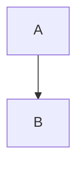
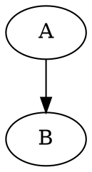
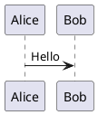

# 図表（Mermaid / Graphviz / PlantUML / D2 / Structurizr / Pikchr / CeTZ / Fletcher / timeliney / finite / Vega-Lite / Vega / WaveDrom / SVG）

通常のフェンスコードブロックとして書きます。

````markdown

```mermaid
graph TD
  A --> B
```


```dot
digraph { A -> B }
```


```plantuml
@startuml
Alice -> Bob: Hello
@enduml
```

```d2
A -> B
```

```structurizr
workspace {
    model {
        user = person "User"
        softwareSystem = softwareSystem "Software System"
        user -> softwareSystem "Uses"
    }
    views {
        systemContext softwareSystem "SystemContext" {
            include *
            autoLayout
        }
    }
}
```

```pikchr
box "開始" fit; arrow; circle "終了"
```

```vega-lite
{
  "data": {"values": [
    {"month": 1, "sales": 10},
    {"month": 2, "sales": 20}
  ]},
  "mark": "line",
  "encoding": {
    "x": {"field": "month", "type": "quantitative"},
    "y": {"field": "sales", "type": "quantitative"}
  }
}
```

```svg
<svg xmlns="http://www.w3.org/2000/svg" width="200" height="100">
  <rect x="10" y="10" width="180" height="80" fill="lightblue"/>
</svg>
```
````

`plugins:` で無効化していない限り自動でレンダリングされます（`graphviz`/`mermaid`/`plantuml`/`d2`/`pikchr`/`cetz`/`fletcher`/`timeliney`/`finite`/`vega`/`wavedrom`とも既定`true`）。**`structurizr`だけは既定`false`です。** 使うには`plugins: { structurizr: true }`と明示する必要があります（内部で使う`structurizr-cli`一式が約99MBあるため）。図をテキストと横並びにしたい場合や、2つの図を比較したい場合は独自のレイアウト記法が使えます。

### 記法ごとの対応

| フェンス | 種別 | Obunzu（HTML出力）での扱い |
| --- | --- | --- |
| `mermaid` |   | ElectronのChromiumで描画します |
| `plantuml` |   | PDF出力と同じ仕組みで、SVGにします |
| `d2` |   | PDF出力と同じ仕組みで、SVGにします |
| `structurizr` |   | PDF出力と同じ仕組みで、SVGにします（`structurizr-cli`でPlantUMLへ書き出してから描画）。既定は無効です（下の「Structurizr固有の注意点」） |
| `svg` |   | そのまま画像として表示します |
| `dot` / `graphviz` |   | PDF出力と同じ仕組み（Typstの`diagraph`）で、SVGにします。PDF出力と、同じ図になります。使えない記法があります（下の「Graphvizで使えない記法」） |
| `pikchr` |   | PDF出力と同じ仕組み（Typstの`kip`。PikchrのWASM版）で、SVGにします。PDF出力と、同じ図になります。構文エラーは、Pikchr自身の説明（行・位置・原因）つきで示します |
| `cetz` / `fletcher` |   | PDF出力と同じ仕組み（Typstの`cetz`・`fletcher`）で、SVGにします。PDF出力と、同じ図になります。`import`・ファイルを読む関数は、使えません（下の「CeTZ・Fletcherについて」） |
| `vega-lite` / `vega` |   | ElectronのChromiumで描画します（同梱の`vega.min.js`・`vega-lite.min.js`を使います。[#351](https://github.com/tokudiro/text-compositor/issues/351)） |
| `wavedrom` |  | 未対応です（[#392](https://github.com/tokudiro/text-compositor/issues/392)）。描画に失敗します |
| `timeliney` |   | PDF出力と同じ仕組み（Typstの`timeliney`）で、SVGにします。PDF出力と、同じ図になります。`import`・ファイルを読む関数は、使えません（下の「timelineyについて」） |
| `finite` |   | PDF出力と同じ仕組み（Typstの`finite`）で、SVGにします。PDF出力と、同じ図になります。`import`・ファイルを読む関数は、使えません（下の「finiteについて」） |

### 記法で描ける図の種類（対応表）

原稿を書くときに「この図を描きたいが、どの記法を使えばいいか」を判断する材料です。`○`＝その記法が、その図の種類を名指しで対応している、`×`＝対応していない。代用の推測は書きません。図の種類の対応が基本ですが、判断を左右する重要な機能差（例: シーケンス図のコンビネーションフラグメント）は、注記に書きます。

`○`には、その機能が入った版を、確認できたものだけ添えています（例: `○(v11.0+)`）。本ツールが同梱する版は、mermaid 11.16.1・PlantUML 1.2026.8・D2 v0.9.0・structurizr-cli v2025.11.09・Vega 6.4.0・Vega-Lite 6.4.3・WaveDrom 3.7.0です。同梱の版が、必要な版以上であることを確認済みです。

`vega`の列は、`vega-lite`と`vega`の両方を指します。`wavedrom`の列は、`signal`（タイミング図）と`reg`（レジスタ図）を指します。この表の`○`は、対応の有無だけを示します。実際の見た目・書き方は、記法ごとのギャラリーページに、`○`の図の種類すべての実例（コード＋出力）があります（[#323](https://github.com/tokudiro/text-compositor/issues/323)）。[Mermaid](14_gallery_mermaid.md)・[PlantUML](15_gallery_plantuml.md)・[D2](16_gallery_d2.md)・[Graphviz](17_gallery_graphviz.md)・[Structurizr](18_gallery_structurizr.md)・[Pikchr](19_gallery_pikchr.md)・[CeTZ](20_gallery_cetz.md)・[Fletcher](21_gallery_fletcher.md)・[timeliney](22_gallery_timeliney.md)・[finite](24_gallery_finite.md)・[Vega-Lite・Vega](23_gallery_vega.md)・[WaveDrom](25_gallery_wavedrom.md)。

#### UML図

| 図の種類 | mermaid | plantuml | d2 | dot/graphviz | structurizr | pikchr | cetz | fletcher | timeliney | finite | vega | wavedrom |
| --- | --- | --- | --- | --- | --- | --- | --- | --- | --- | --- | --- | --- |
| シーケンス図 | ○ | ○ | ○ | × | × | × | × | × | × | × | × | × |
| タイミング図 | × | ○ | × | × | × | × | × | × | × | × | × | ○ |
| クラス図 | ○ | ○ | ○ | ×※1 | × | × | × | × | × | × | × | × |
| 状態遷移図 | ○※6 | ○ | × | × | × | × | × | × | × | ○※11 | × | × |
| ユースケース図 | ×※3 | ○ | × | × | × | × | × | × | × | × | × | × |
| アクティビティ図 | × | ○ | × | × | × | × | × | × | × | × | × | × |
| コンポーネント図／配置図 | × | ○ | × | × | ○ | × | × | × | × | × | × | × |
| オブジェクト図 | × | ○ | × | × | × | × | × | × | × | × | × | × |
| パッケージ図 | × | ○ | × | × | × | × | × | × | × | × | × | × |
| 複合構造図 | × | × | × | × | × | × | × | × | × | × | × | × |
| プロファイル図 | × | × | × | × | × | × | × | × | × | × | × | × |
| コミュニケーション図 | ×※9 | × | × | × | ○ | × | × | × | × | × | × | × |
| 相互作用概要図 | × | × | × | × | × | × | × | × | × | × | × | × |

#### SysML図（要求図以外は、上のUML図と共通。SysML v2.0は対象外※4）

| 図の種類 | mermaid | plantuml | d2 | dot/graphviz | structurizr | pikchr | cetz | fletcher | timeliney | finite | vega | wavedrom |
| --- | --- | --- | --- | --- | --- | --- | --- | --- | --- | --- | --- | --- |
| 要求図 | ○ | × | × | × | × | × | × | × | × | × | × | × |
| ブロック定義図（BDD） | × | × | × | × | × | × | × | × | × | × | × | × |
| 内部ブロック図（IBD） | × | × | × | × | × | × | × | × | × | × | × | × |
| パラメトリック図 | × | × | × | × | × | × | × | × | × | × | × | × |

#### C4モデル図（UML・SysMLとは別の、独自のモデル。コミュニケーション図に相当するDynamic図は、上のUML図の表を参照）

| 図の種類 | mermaid | plantuml | d2 | dot/graphviz | structurizr | pikchr | cetz | fletcher | timeliney | finite | vega | wavedrom |
| --- | --- | --- | --- | --- | --- | --- | --- | --- | --- | --- | --- | --- |
| System Context図 | ×※9 | ×※2 | × | × | ○ | × | × | × | × | × | × | × |
| コンテナ図 | ×※9 | ×※2 | × | × | ○ | × | × | × | × | × | × | × |
| コンポーネント図 | ×※9 | ×※2 | × | × | ○ | × | × | × | × | × | × | × |
| システムランドスケープ図 | × | ×※2 | × | × | ○ | × | × | × | × | × | × | × |
| デプロイメント図 | ×※9 | ×※2 | × | × | ○ | × | × | × | × | × | × | × |

#### その他

| 図の種類 | mermaid | plantuml | d2 | dot/graphviz | structurizr | pikchr | cetz | fletcher | timeliney | finite | vega | wavedrom |
| --- | --- | --- | --- | --- | --- | --- | --- | --- | --- | --- | --- | --- |
| フローチャート | ○ | × | ○ | ○ | × | ○ | × | × | × | × | × | × |
| ノードとエッジ図 | ○ | × | ○ | ○ | × | ○ | × | ○ | × | × | ○※10 | × |
| ER図 | ○(v8.5+) | ×※7 | ○ | ×※1 | × | × | × | × | × | × | × | × |
| ガントチャート | ○ | ○ | × | × | × | × | × | × | ○ | × | × | × |
| データ可視化 | ○ | × | × | × | × | × | × | × | × | × | ○ | × |
| マインドマップ | ○ | ○ | × | × | × | × | × | × | × | × | × | × |
| Git履歴図 | ○ | × | × | × | × | × | × | × | × | × | × | × |
| タイムライン | ○ | × | × | × | × | × | × | × | × | × | × | × |
| カンバン | ○(v11.4+) | × | × | × | × | × | × | × | × | × | × | × |
| アーキテクチャ図 | ○(v11.1+) | × | × | × | ×※8 | × | × | × | × | × | × | × |
| ポジションマップ（クアドラントチャート） | ○ | × | × | × | × | × | × | × | × | × | × | × |
| ネットワーク構成図 | × | × | ○ | × | × | × | × | × | × | × | × | × |
| ラック構成図 | × | × | × | × | × | × | × | × | × | × | × | × |
| パケット構造図 | ○ | × | × | × | × | × | × | × | × | × | × | ○※12 |
| 幾何図形・自由描画 | × | × | × | × | × | ○ | ○ | × | × | × | × | × |
| 可換図式・木構造 | × | × | × | × | × | × | ○ | ○ | × | × | × | × |

#### データ可視化（グラフ）の種類

グラフを描ける記法は、`mermaid`と`vega-lite`（`vega`を含む）です。この表は、2つだけを比べます。Mermaidの`xychart-beta`は棒グラフと折れ線グラフ、`pie`は円グラフ、`treemap-beta`はツリーマップを描けます。それ以外の図の種類が必要なときは、Vega-Liteを使います。実例は、[Vega-Lite・Vegaのギャラリー](23_gallery_vega.md)にあります。

| 図の種類 | mermaid | vega-lite / vega |
| --- | --- | --- |
| 棒グラフ | ○ | ○ |
| 折れ線グラフ | ○ | ○ |
| 円グラフ | ○ | ○ |
| ツリーマップ | ○ | ○※10 |
| 散布図 | × | ○ |
| ヒストグラム | × | ○ |
| ヒートマップ | × | ○ |
| 箱ひげ図 | × | ○ |
| 対数軸 | × | ○ |
| ファセット分割（同じ軸で複数のグラフを並べる） | × | ○ |
| 力学レイアウト（ネットワーク図） | × | ○※10 |
| ワードクラウド | × | ○※10 |

**注記**

- ※1 Graphvizの`shape=record`は、このツールでは使えません（[#264](https://github.com/tokudiro/text-compositor/issues/264)）。
- ※2 PlantUMLでC4モデルを描く方法（C4-PlantUML）はありますが、外部からファイルを取得する必要があり、本ツールの方針に反するため使えません。
- ※3 mermaidのユースケース図は、v12.0.0以降で対応予定です。本ツールが同梱する版（11.16.1）には、まだ入っていません。
- ※4 SysML v2.0は、2025年9月に発行されたばかりの、別物の新標準（旧来のダイアグラム構成ではなく、テキスト中心の新しい言語）です。主要なMBSE専用ツール（Cameo、CATIA Magicなど）でも対応はまだ発展途上で、既存のSysML 1.xの資産が多いため、当面はv1.xとの併存が見込まれます。8記法のいずれも、SysML v2.0への対応はありません。
- ※5 分岐・繰り返し（コンビネーションフラグメント。`alt`/`opt`/`loop`等）に対応するかどうかで、実用性が大きく変わります。mermaid・PlantUML・D2は対応します。
- ※6 mermaidは、サブマシン状態（複合状態）・並行状態（fork/join）・選択擬似状態には対応しますが、**履歴状態（history state）は非対応です。** 異なる複合状態の内部状態どうしを、直接つなぐ遷移も書けません。PlantUMLは、この2つに対応します。
- ※7 **実機で確認済みです。** PlantUMLの「Information Engineering diagram」（`entity`キーワード、鳥の足の関係記法）を、実際にレンダリングしました。結果は、クラス図のアイコン（"C"）が"E"に変わり、関係線に鳥の足の記法が付くだけで、見た目・作りとも、ほぼクラス図そのものでした（PlantUML自身も「クラス図の拡張」と説明しています）。クラス図の行で、すでにPlantUML＝○として数えているため、二重計上を避け、この行は`×`にしています。
- ※8 StructurizrのSystem Landscape viewは、対象を1つのソフトウェアシステムに絞らない、System Context viewの一種です（C4モデル公式サイトの説明による）。見た目は同じ、抽象的な四角（Person・Software System）で、クラウドベンダーのアイコンは使いません。「システムランドスケープ図」の行で、すでにStructurizr＝○として数えているため、二重計上を避け、この行は`×`にしています。
- ※9 **実機で確認済みです。** mermaidのC4系の図（System Context・コンテナ・コンポーネント・デプロイメント・Dynamic）は、PNGアイコンを`xlink:href`で埋め込みますが、SVGのルート要素に、その名前空間の宣言がありません。ブラウザでの表示は問題ありませんが、Typstに通すと「failed to parse SVG（unknown namespace prefix 'xlink'）」で失敗し、**PDF出力ができません。** HTML出力（Obunzu）でのみ使えます。
- ※10 `vega`（Vega本体）でだけ描けます。`vega-lite`では描けません。仕様は長くなります。実例は、[Vega-Lite・Vegaのギャラリー](23_gallery_vega.md)にあります。
- ※11 有限オートマトンの状態遷移図です。受理状態の二重丸など、オートマトン理論の記法で描きます。複合状態・並行状態など、一般のUMLの状態遷移図には向きません（それらは、mermaid・plantumlを使います）。
- ※12 WaveDromの`reg`（レジスタ・ビットフィールド図）で描けます。ビット幅つきのフィールドを並べる図で、通信のパケットの構造も、同じ形で書けます。

### Graphvizで使えない記法

Graphvizは、PDF出力・Obunzu・Python APIのすべてで、Typstの`diagraph`で描きます。次の記法は、描けないか、見た目が変わります。

| 使えないもの | 何が起きるか |
| --- | --- |
| データ構造の図（`shape=record`・`Mrecord`） | 仕切りの記号（`{名前\|年齢}`など）が、そのまま文字で、1つの箱に出ます。Obunzu・Python APIでは、警告を出します（PDF出力は、警告なし） |
| 図全体のタイトル（`label="…"`・`labelloc`） | 表示されません。Obunzu・Python APIでは、警告を出します（PDF出力は、警告なし）。タイトルは、Markdownの本文に書くか、`cluster`の`label`（描けます）にしてください |
| 表を使ったラベル（HTMLラベル） | 文字が、セルからはみ出す場合があります（警告なし） |
| ラテン文字のノード名（`a`・`b`など） | 斜体の明朝系の字体になります。日本語のラベルは、普通の字体です（警告なし） |

警告は、DOTを簡易に調べて出します。ノードの`label`や`cluster`の`label`は、描けるため、警告しません。

### Pikchrについて

Pikchr（SQLiteの作者が作った、図を文章で書く言語。[公式](https://pikchr.org/)）は、`box`・`arrow`・`circle`などを並べて、図を書きます。

```pikchr
box "設定" fit
arrow
box "変換" fit
arrow
circle "PDF"
```

- 日本語のラベルも、使えます。`{width=...}`/`{height=...}`で、大きさを指定できます（下の「サイズ指定」）。
- 構文エラーがあると、ビルドは失敗し、Pikchr自身の説明（該当の行・位置・原因）が出ます。行は、原稿の行です。
- `.pikchr`ファイルも、`chapters`に指定できます（1ファイル＝1章）。Obunzuでも、単体のファイルとして開けます。
- PDF出力もObunzuも、同梱のPikchrのWASM版（Typstの`kip`）で描くため、同じ図になります。`plugins.pikchr: false`で、無効にできます。
- Pikchrの記法は、[公式のドキュメント](https://pikchr.org/home/doc/trunk/doc/userman.md)を参照してください。

### CeTZ・Fletcherについて

`cetz`・`fletcher`は、Typstの描画ライブラリで、図を描きます。幾何図形・木構造・グラフは、CeTZ（[公式](https://typst.app/universe/package/cetz)）が得意です。ノードと矢印の図（フローチャート・状態遷移図・可換図式）は、Fletcher（[公式](https://typst.app/universe/package/fletcher)）が得意です。

`cetz`には、CeTZの描画関数（`circle`・`line`・`content`など）を、1行に1つずつ書きます。

````markdown
```cetz
circle((0, 0), radius: 1)
line((0, 0), (2, 1))
content((1, 0.5), [日本語のラベル])
```
````

`fletcher`には、`diagram(...)`の引数を、コンマで区切って書きます。

````markdown
```fletcher
node((0, 0), [開始]), edge("->"), node((1, 0), [処理]), edge("->"), node((2, 0), [終了])
```
````

- 日本語のラベルも、使えます。`{width=...}`/`{height=...}`で、大きさを指定できます（下の「サイズ指定」）。指定しなければ、行の幅より広いときだけ、縮小します。
- `import`・`include`は、書けません（書くと、原稿の行つきのエラーになります）。CeTZの描画関数は、最初から使えます（`cetz.draw`のすべて。`cetz.vector`・`cetz.tree`などは、`cetz.`をつけて使えます）。Fletcherは、`node`・`edge`・`shapes`（`shapes.diamond`など）・`fletcher`が使えます。
- ファイルを読む関数（`read`・`json`・`csv`など）も、使えません。原稿が、意図しないファイルを、読まないようにするためです。
- Typstの構文や関数名の間違いは、ビルドが失敗し、Typstのメッセージが出ます。行は、フェンスの開始行です（コードの中の位置は、出ません）。
- PDF出力もObunzuも、同梱のTypstのパッケージ（`cetz`・`fletcher`）で描くため、同じ図になります。`plugins.cetz: false`・`plugins.fletcher: false`で、それぞれ無効にできます。
- CeTZは、LGPL-3.0以降のライセンスです。Obunzuには、改造せずに、同梱しています（ライセンスの全文とソースの入手先は、配布物の`licenses/`にあります）。
- 記法は、それぞれの公式のドキュメント（[CeTZ](https://cetz-package.github.io/docs/)・[Fletcher](https://github.com/Jollywatt/typst-fletcher)）を参照してください。

レイアウトのブロック（`::: layout-...`・`::: align`）も、PDF出力とObunzuの両方で使えます。Obunzuでは、CSSで近似するため、見た目が、PDF出力と少し違う場合があります。

### timelineyについて

`timeliney`（[公式](https://typst.app/universe/package/timeliney)）は、Typstのパッケージで、ガントチャートを描きます（[#294](https://github.com/tokudiro/text-compositor/issues/294)）。Mermaid/PlantUMLのガントチャートと違い、本文と同じフォント・配色で、その場に描画されます。一方、日付の自動計算・タスクの依存関係の自動連結はありません（列の位置は、数値で指定します）。

`timeliney`には、`headerline`・`taskgroup`・`task`・`milestone`などの呼び出しを、1行に1つずつ書きます。

````markdown
```timeliney
headerline(group(([*2024*], 4)))
taskgroup(title: [開発], {
  task("設計", (0, 1))
  task("実装", (1, 3))
})
milestone(at: 3, align(center, [リリース]))
```
````

- 列（`0`・`1`など）は、日付ではなく、`headerline`で定義した見出しの並びに対する位置（インデックス）です。日付との対応づけは、自分で行います。
- 幅いっぱいに描くよう作られているため、`{width=...}`を指定しなければ、行の幅いっぱいになります（他の記法のような、行の幅を超えたときだけ縮小する動作ではありません）。`{height=...}`は、大きさの目安として使われるだけで、内容がそれより大きければあふれます（高さは、行の数で決まるため）。
- `import`・`include`・ファイルを読む関数（`read`・`json`・`csv`など）は、使えません。CeTZ・Fletcherと同じ理由です。
- PDF出力もObunzuも、同梱のTypstのパッケージ`timeliney`で描くため、同じ図になります。`plugins.timeliney: false`で、無効にできます。
- 記法は、[公式のドキュメント](https://github.com/pta2002/typst-timeliney)を参照してください。

### finiteについて

`finite`（[公式](https://typst.app/universe/package/finite)）は、Typstのパッケージで、有限オートマトン（状態遷移図）を描きます（[#292](https://github.com/tokudiro/text-compositor/issues/292)）。受理状態は二重丸、開始状態は矢印、状態名は添字つき（`q0`は、q₀）と、オートマトン理論の標準の記法で描きます。Mermaid・PlantUMLの状態遷移図では、二重丸を描けません。一方、複合状態・並行状態など、一般のUMLの状態遷移図には向きません（それらは、Mermaid・PlantUMLを使います）。

`finite`には、遷移表の辞書と、`initial:`（開始状態）・`final:`（受理状態）などを、`automaton(...)`の引数として書きます。

````markdown
```finite
(
  q0: (q0: "0", q1: "1"),
  q1: (q2: "0", q0: "1"),
  q2: (q1: "0", q2: "1"),
),
initial: "q0",
final: ("q0",)
```
````

- 遷移表は、`状態: (行き先: ラベル, ...)`の辞書です。自己遷移は、行き先に、自分を書きます。複数のラベルは、`"0,1"`のように、1つの文字列にします。遷移のない状態は、`none`と書きます。
- `layout: layout.circular`のように、配置を指定できます。
- 状態や遷移が増えると、遷移のラベルが重なって、読めなくなる場合があります。配置を変えて、試してください（図によって、向き不向きがあります）。開始状態の矢印の文字は、「Start」です。
- `{width=...}`・`{height=...}`は、CeTZ・Fletcherと同じく、縦横比を保って、拡大・縮小します。
- `import`・`include`・ファイルを読む関数（`read`・`json`・`csv`など）は、使えません。CeTZ・Fletcherと同じ理由です。
- PDF出力もObunzuも、同梱のTypstのパッケージ`finite`で描くため、同じ図になります。`plugins.finite: false`で、無効にできます。
- 記法は、[公式のドキュメント](https://github.com/jneug/typst-finite)を参照してください。

### WaveDromについて

`wavedrom`（[WaveDrom](https://wavedrom.com/)）は、JSONの仕様で、デジタルのタイミング図（波形図）とレジスタ図を描く記法です（[#299](https://github.com/tokudiro/text-compositor/issues/299)）。ハードウェアやプロトコルの仕様書で使います。

````markdown
```wavedrom
{ "signal": [
  { "name": "clk",  "wave": "p......." },
  { "name": "req",  "wave": "0.1..0.." },
  { "name": "data", "wave": "x.345x..", "data": ["a", "b", "c"] },
  { "name": "ack",  "wave": "1.0...10" }
]}
```

```wavedrom
{ "reg": [
  { "name": "opcode", "bits": 7 },
  { "name": "rd",     "bits": 5 },
  { "name": "imm",    "bits": 20 }
]}
```
````

- **描けるのは、`signal`（タイミング図）と`reg`（レジスタ図）です。** どちらも、WaveDrom 3.7.0に含まれます。書き方は、[WaveDromのチュートリアル](https://wavedrom.com/tutorial.html)を参照してください。
- **仕様は、厳密なJSONだけです。** WaveDrom本家が許す`{ signal: [...] }`のような、キーに引用符のない記法や、コメントは使えません（原稿の文字列を、ブラウザの中で、コードとして実行しないためです）。JSONの誤りは、エラーの行と桁で報告します。`signal`か`reg`が無い仕様、空の配列も、エラーで止めます（WaveDromは、描けない入力でも、エラーにせず、空の図を返すためです）。
- 描画には、Mermaid・Vegaと同じヘッドレスブラウザ（Chrome/Edge）を使います。初回だけ、`wavedrom.min.js`とスキン（合わせて約98KB）を取得し、ユーザーキャッシュに保存します（SHA256を固定して検証します）。外部への通信は、この取得だけです。
- サイズは、図の大きさで決まります。フェンスの`{width=...}`でも指定できます。
- 図のスキンは、既定のものだけです。
- `plugins.wavedrom: false`で、無効にできます。
- Obunzuでは、まだ描けません（[#392](https://github.com/tokudiro/text-compositor/issues/392)）。

### Vega-Lite / Vegaについて

`vega-lite`と`vega`（[Vega-Lite](https://vega.github.io/vega-lite/)・[Vega](https://vega.github.io/vega/)）は、JSONの仕様でグラフを描く記法です（[#211](https://github.com/tokudiro/text-compositor/issues/211)）。Mermaidの`xychart-beta`（棒グラフと折れ線グラフのみ）では描けない、ファセット分割（同じ軸で複数のグラフを並べる）・対数軸・散布図・ヒストグラムなどが使えます。単純な円グラフや棒グラフは、Mermaidのほうが短く書けます。

````markdown
```vega-lite
{
  "data": {"values": [
    {"region": "east", "month": 1, "sales": 10},
    {"region": "east", "month": 2, "sales": 20},
    {"region": "west", "month": 1, "sales": 100},
    {"region": "west", "month": 2, "sales": 300}
  ]},
  "mark": "line",
  "encoding": {
    "x": {"field": "month", "type": "quantitative"},
    "y": {"field": "sales", "type": "quantitative", "scale": {"type": "log"}},
    "facet": {"field": "region", "type": "nominal"}
  },
  "width": 120,
  "height": 80
}
```
````

- **第一選択は`vega-lite`です。** `vega`は、Vega-Liteで表現できない図（力学レイアウト・ワードクラウドなど）を描くときの、上級者向けの記法です。記述量は、Vegaのほうが多くなります。
- **データは、`data.values`に、インラインで書くか、`data.url`で、ローカルのファイルを参照します**（[#350](https://github.com/tokudiro/text-compositor/issues/350)）。`"data": {"url": "data/sales.csv"}`のように書くと、ファイルの中身を、図に取り込みます。数百行を超えるデータは、別ファイルにすると、原稿のdiffが埋もれません。
  - **読めるのは、プロジェクトのルートの中の、`.csv`・`.tsv`・`.json`のファイルだけです。** 相対パスは、原稿のファイルの場所が基準です（画像と同じ）。ルートは、configのあるフォルダです。`text-compositor`にMarkdownを1つだけ渡す使い方や、Obunzuでは、開いた原稿のフォルダです。
  - **次のものは、エラーで止めます**: `http://`などのURL、絶対パス、ルートの外を指すパス（`../`で出るもの、外を指すシンボリックリンクを含む）、上の3つ以外の拡張子、10 MBを超えるファイル、UTF-8でないファイル、存在しないファイル。`image`マークの`url`など、データ以外の`url`も、エラーです。ネットワークには、一切出ません。
  - 形式は、拡張子から決まります。仕様の`format`（`parse`・`property`など）も、そのまま使えます。`format.type`を書けば、そちらが優先されます。CSVの数値・日付の型は、Vega自身が判定します。
  - データファイルを変えると、図は描き直されます。`--if-changed`・`--watch`・Obunzuの自動更新も、データファイルの変更を検知します。
- **diffを見やすくする書き方があります。** データは1行に1件、それ以外は1キー1行で書くと、値や設定の変更が、1行の差分になります。データの1件を5行に展開すると、差分が読みにくくなります。
- 仕様は、JSONです（YAMLやコメントは使えません）。JSONの誤りは、エラーの行と桁で報告します。
- 描画には、Mermaidと同じヘッドレスブラウザ（Chrome/Edge）を使います。初回だけ、`vega.min.js`・`vega-lite.min.js`（合わせて約772KB）を取得し、ユーザーキャッシュに保存します（SHA256を固定して検証します）。`plugins.mermaid_auto_download`は、Vega・Vega-Liteにも効きます。
- サイズは、仕様の`width`・`height`で決まります。フェンスの`{width=...}`でも指定できます。
- `plugins.vega: false`で、無効にできます。

`svg`フェンスはMermaid/PlantUML/Graphvizと異なりレンダリングを一切行いません。SVGは既にテキストで完結したベクター画像フォーマットのため、コードの内容をそのまま画像として埋め込みます。外部ツールへの依存が無いため`plugins:`の無効化対象にもなりません（常時有効）。

### 既存のSVGファイルを画像として貼る

 

コードを原稿に直接書くのではなく、すでに手元にある`.svg`ファイルを貼りたい場合は、`svg`フェンスを使わず通常のMarkdown画像記法だけで済みます。TypstがSVGをネイティブにサポートしているため、専用の対応やレンダリングを追加しなくてもそのまま埋め込まれます。

```markdown

```

PNG/JPEGと同じ画像として扱われるため、[Markdown画像の配置・サイズ指定](06_markdown_basics.md)（`alt|width=`/`align=`構文）やレイアウト記法（`layout-right`等）もそのまま使えます。`svg`フェンスとの使い分けは、「別ファイルとして管理された既存のSVGを貼るか」「原稿に直接コードを書くか」です。

## サイズ指定（width/height）

 

図は既定でページ幅・高さの上限（Mermaid/PlantUML/D2は12cm、Graphviz/Pikchr/CeTZ/Fletcher/finiteはページ幅）を超えないよう自動縮小されます。ただし、拡大はされません。timelineyは既定で行の幅いっぱいになります（上の「timelineyについて」）。明示的にサイズを指定したい場合は、言語名の後ろに`{width=...}`/`{height=...}`を書きます。

````markdown

```mermaid {width=50%}
graph TD
  A --> B
```


```dot {width=8cm height=6cm}
digraph { A -> B }
```
````

- `mermaid`/`plantuml`/`dot`/`graphviz`/`svg`/`d2`/`structurizr`/`pikchr`/`cetz`/`fletcher`/`timeliney`/`finite`のいずれのフェンスでも使えます。`width`/`height`は片方だけでも両方でも指定できます。`cetz`/`fletcher`/`finite`は、縦横比を保って拡大・縮小し、両方を指定したときは、その枠に収めます。`timeliney`は、拡大・縮小ではなく、指定した幅をそのままコンテナの幅にします（上の「timelineyについて」）。
- 値はTypstがそのまま解釈できる文字列（`50%`、`8cm`等）です。
- 明示指定すると自動縮小は働かなくなり、指定した値がそのまま使われます。**拡大も含めて指定どおりに反映される**ため、ページからはみ出さないかは自分で確認してください。
- 未指定の場合は従来どおり、はみ出さないよう自動で縮小されます（拡大はされません）。
- `layout-right`/`layout-left`/`layout-compare`内の図でも同じ記法が使えます。`layout-feature`内では、Markdown画像は写真用レイアウトの仕様上サイズ指定を無視して常に枠いっぱいに敷き詰められます。一方、Mermaid/PlantUML/Graphviz/D2/Structurizr/Pikchr/CeTZ/Fletcher/timelineyのフェンスは対象外（このレイアウトの想定用途ではない使い方）のため`{width=...}`/`{height=...}`がそのまま反映されます。

## 余白のトリミング（trim）

mermaid/plantuml/d2/structurizrは、それぞれのツール自身が、生成するSVGに余白（マージン）を持たせます（#315）。text-compositorは、D2の`--pad`を8pxに、mermaidのflowchart/sequenceの余白設定を8pxに、それぞれ既定より縮めていますが、それでも図によっては余白が気になる場合があります。

`plugins.diagram_trim: true`（既定`false`）にすると、生成後のSVGを実際に描かれている範囲（＋小さな安全マージン）へ、自動でトリミングします。`resvg_py`・`Pillow`という追加のpipパッケージが必要です（`pip install resvg_py Pillow`）。まだ実績の少ない機能のため、既定はopt-inです。

```yaml
plugins:
  diagram_trim: true
```

図ごとに上書きしたい場合は、`{width=...}`/`{height=...}`と同じフェンス属性として`{trim=true}`/`{trim=false}`を書きます。

````markdown

```mermaid {trim=false}
graph TD
  A --> B
```
````

- 対象はmermaid/plantuml/d2/structurizr（外部ツールが生成するSVG）です。`svg`フェンス（ユーザー自身が書いたSVG）・graphviz/pikchr/cetz/fletcher/timeliney/finite（Typst側で完結し、元から余白がほぼ無い）には効きません。
- トリミングに失敗した場合（内容の判定ができない等）は、警告を出した上で、元の（トリミングしていない）SVGのまま使います。図自体は正しく描画済みのため、ビルドは失敗しません。
- `plugins.diagram_trim: true`にしたのに`resvg_py`・`Pillow`が入っていない場合は、Fail-fastでエラー終了します。`--check-env`で事前に確認できます。

## ローカルにブラウザ／Java／D2が無い場合

Mermaid・Vega-LiteはChrome/Edge、PlantUML・StructurizrはJava（11以上）、D2はD2 CLI本体が必要です。システムに見つからない場合の挙動は`plugins.mermaid_auto_download`/`plugins.plantuml_auto_download`/`plugins.d2_auto_download`/`plugins.structurizr_auto_download`で制御します（「plugins: 図表プラグインの有効・無効」の章）。既定はMermaidがエラー終了、PlantUML・D2・Structurizrが自動取得（それぞれ約50MB・約13MB・Java約50MB+structurizr-cli約99MB）です。**Mermaid側を`true`にすると、Playwright自身のChromium（約700MB）をダウンロードする**点に注意してください。GitHub Actionsの`ubuntu-latest`にはMermaid用のブラウザ・PlantUML/Structurizr用のJavaが標準搭載されているため、CI上では追加取得は発生しません。一方、D2 CLI・structurizr-cliは標準搭載されていないため、初回ビルド時に自動取得されます（`structurizr`は既定無効のため、有効化しない限り取得自体が発生しません）。

## Mermaid固有の注意点

- 余白（`flowchart.padding`の既定15px、`sequence.diagramMarginX`の既定50px・`diagramMarginY`の既定10px）は、本文へ埋め込む小さな図には過大なため、いずれも8pxに縮めて呼び出しています（`graph TD`の2ノードだけの図で実測87×164→縮小後は概ね59×136相当、#315）。これらは内容のレイアウト後に外側へ付け足す余白のため、縮めても図の内容が見切れることはありません。
- 上記はflowchart・sequenceの2種類のみの対応です。class/state/er/gantt等、他の図の種類は、それぞれ別の設定キー・既定値を持つため未対応です（#315）。

## PlantUML固有の注意点

- `@startuml` / `@enduml` を省略せず、実際のPlantUML構文どおりに書いてください（自動補完はしません）。
- レイアウトエンジンには純Java実装の Smetana を使うため、`dot`（Graphviz）等の外部バイナリは不要です。
- `plantuml.jar`（MIT版）は初回ビルド時のみ取得し、OS標準のユーザーキャッシュ領域（Windows: `%LOCALAPPDATA%\text-compositor\Cache`、Linux: `~/.cache/text-compositor`、macOS: `~/Library/Caches/text-compositor`）にキャッシュします。Eclipse Temurin JREを自動取得した場合も同じ領域にキャッシュします。

## D2固有の注意点

- レイアウトエンジンは既定の`dagre`です。PlantUML/Graphvizと異なり、D2の構文自体はコード例のとおり`A -> B`のようにシンプルです（詳しい書き方は[D2公式ドキュメント](https://d2lang.com/)を参照してください）。
- D2公式CLIバイナリ（Go製の単一実行ファイル）は初回ビルド時のみ取得し、PlantUML/Mermaidと同じOS標準のユーザーキャッシュ領域にキャッシュします。システムに`d2`コマンドが既にあればそちらを再利用し、ダウンロードは発生しません。
- D2 CLI自体の余白（`--pad`）の既定値は100px（上下左右）で、小さな図には過大なため、8pxに縮めて呼び出しています（`A -> B`だけの図で実測258×434→74×250、#315）。余白はD2側でバウンディングボックス計算後に付け足す値のため、縮めても図の内容が見切れることはありません。

## Structurizr固有の注意点

- **既定で無効です。** 使うには`plugins: { structurizr: true }`を明示してください（内部で使う`structurizr-cli`一式が約99MBあるため）。
- 中身は、実際のStructurizr DSL構文どおりに書きます（[Structurizr DSL公式ドキュメント](https://docs.structurizr.com/dsl/language)を参照）。新しい描画コードは持たず、公式`structurizr-cli`でPlantUMLへ書き出し、PlantUMLと同じパイプラインで描画するだけです。
- **1つのワークスペースが定義できるビューは、1フェンスにつき1つだけです。** `structurizr-cli`は、ワークスペースが定義するビューの数だけファイルを分けて書き出す仕様で、こちらから1つだけ選ぶ方法がありません。2つ以上のビュー（`systemContext`と`container`を両方書く等）を定義すると、エラーで終了します。System ContextとContainerの両方を見せたい場合は、フェンスを2つに分け、共通のモデル定義はDSLの`!include`で別ファイルに切り出してください。
- `plugins.structurizr_auto_download`（既定`true`）で、Java・`structurizr-cli`一式の自動取得を制御します。`plugins.plantuml_auto_download`とは別の設定です（Structurizrを使うプロジェクトが、常にPlantUMLのフェンスも使うとは限らないため）。`plantuml.jar`自体は、`plugins.plantuml`の値に関わらず、内部実装として常に取得されます。

````markdown
::: layout-right
左にこのテキスト、右に図が並びます。


```mermaid
graph TD
  A --> B
```
:::
````

`::: layout-right`/`::: layout-compare`の中に置ける図は、Mermaidに限らずPlantUML・Graphviz（`dot`/`graphviz`フェンス）・D2（`d2`フェンス）・Structurizr（`structurizr`フェンス）・Pikchr・CeTZ・Fletcher・timeliney・finite・SVG（`svg`フェンス）・Markdown画像（``、単独行のみ）のいずれも使えます。`::: layout-compare ... :::` は2つの図を左右に並べます（横長の図には不向き）。2つの種類を混在させる（例: 片方はMermaid図、もう片方は写真）こともできます。

図を左・テキストを右に置きたい場合は`layout-right`の左右反転版`layout-left`が使えます。中に置ける図の種類・書式は`layout-right`と同じです。

````markdown
::: layout-left
左に図、右にこのテキストが並びます。


```mermaid
graph TD
  A --> B
```
:::
````

左右の比率を変えたい場合は、ブロック名の後ろに`{left=... right=...}`を付けます（例: `layout-right {left=30 right=70}`）。省略時は`layout-right`がテキスト35:図65、`layout-left`が図65:テキスト35です。数字は比率として扱われるだけなので、合計が100である必要はありません（`{left=3 right=7}`と`{left=30 right=70}`は同じ見た目になります）。片方だけ指定した場合、もう片方は省略時の既定値のままです。

````markdown
::: layout-right {left=30 right=70}
テキストを控えめに、図を広めに配置します。


```mermaid
graph TD
  A --> B
```
:::
````

````markdown
::: layout-compare

```mermaid
graph TD
  A --> B
```


:::
````

## layout-feature: 写真メイン＋キャッチコピー

 

写真（または図）をフルブリードで敷き、下部に半透明の帯とキャッチコピーを重ねるレイアウトです。表紙・扉スライドなどで使います。

````markdown
::: layout-feature


かんたん、そのまま。
:::
````

中に置ける図/画像は`layout-right`/`layout-compare`と同じくMermaid・PlantUML・Graphviz・D2・Pikchr・CeTZ・Fletcher・timeliney・finite・SVG・Markdown画像のいずれも使えます。ただし、想定用途はほぼ写真です。写真はMarkdown側の`alt|width=`指定に関わらず枠いっぱいに敷き詰められ（トリミングあり）、縦長・横長どちらの写真でも枠からはみ出しません。

想定している用途はスライド自体と同じ横長〜正方形に近い写真です。縦長写真を置くと上下がトリミングされます（枠の高さに収まるよう左右基準で拡大されるため）。縦長写真の全体を見せたい場合はこのレイアウトの対象外とし、通常のMarkdown画像として配置してください。

## layout-columns: 箇条書き等をN列に分割

 

中身（任意のMarkdown）をN列に流し込みます。列数は省略時2列、`layout-columns {n=3}`のように`{n=...}`を付けるとN列にできます。

````markdown
::: layout-columns
- 項目1
- 項目2
- 項目3
- 項目4
:::

::: layout-columns {n=3}
- Alpha
- Beta
- Gamma
- Delta
- Epsilon
- Zeta
:::
````

`layout-right`/`layout-compare`と異なり中身の種類は問わず、箇条書き以外（段落など）が混在してもエラーにはなりません。

## layout-takahashi: 画面中央に大きな文字を表示する

 

高橋メソッド（1スライドに短い言葉を大きな文字だけで見せるプレゼン手法）のように、中身を画面の上下左右中央に大きな文字で表示したい場合は`::: layout-takahashi`を使います。

````markdown
::: layout-takahashi
やります。
:::
````

文字サイズは既定で96ptです。内容の長さに合わない場合は`{size=...}`で上書きできます。

````markdown
::: layout-takahashi {size=48pt}
少し長めの一言。
:::
````

`{size=...}`を省略した場合は既定の96ptのまま表示されます。値はTypstがそのまま解釈できる文字列（`48pt`等）で、他のlayout系ブロックの属性（`layout-right`の`left=`/`right=`等）と同様に妥当性チェックは行いません（不正な値はTypst側のコンパイルエラーになります）。

## align: 段落を中央寄せ・右寄せにする

 

本文（段落）を中央寄せ・右寄せにしたい場合は`::: align {align=...}`を使います。中身は複数行・複数段落でも構いません。

````markdown
::: align {align=center}
中央寄せにしたい段落。
:::

::: align {align=right}
右寄せにしたい段落。
:::
````

- `{align=center}`/`{align=right}`のいずれかを指定します。`{align=left}`も明示できます。ただし、指定しない場合と見た目は変わりません。
- `{align=...}`を省略した場合の見た目は、既定（左寄せ）から変わりません。
- Markdown画像側の``のような属性（画像1枚だけの配置指定、[#75](https://github.com/tokudiro/text-compositor/issues/75)）とは別の記法です。画像1枚だけを中央寄せ・右寄せにしたい場合は画像側の`align`属性を、段落（テキスト）をまとめて寄せたい場合はこの`::: align`ブロックを使います。
