# Mermaidのギャラリー

`mermaid`が対応する図の種類の実例です（[#291の対応表](08_diagrams.md#記法で描ける図の種類対応表)）。記法の説明は「図表」の章の「Mermaid固有の注意点」を参照してください。

## シーケンス図

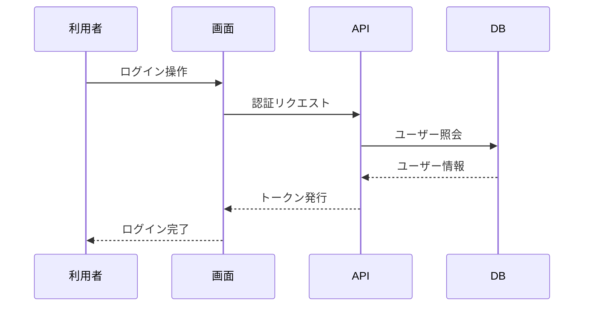

## クラス図

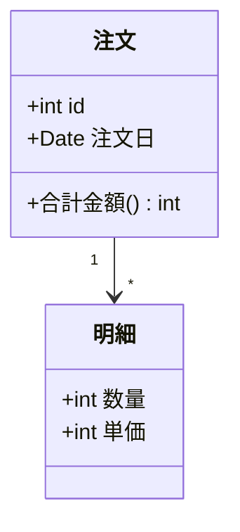

## 状態遷移図

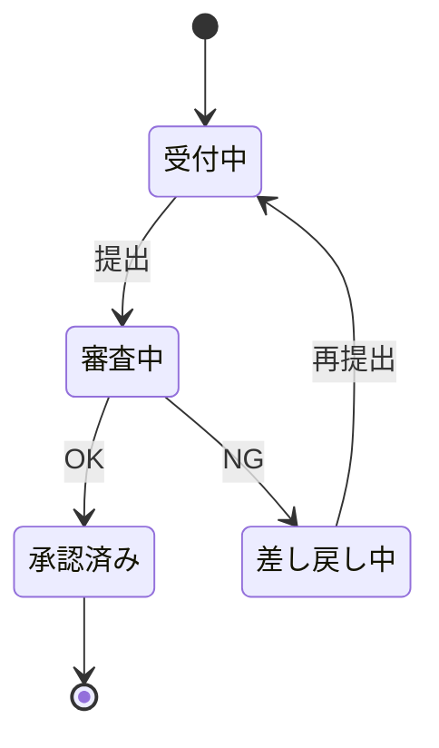

## 要求図

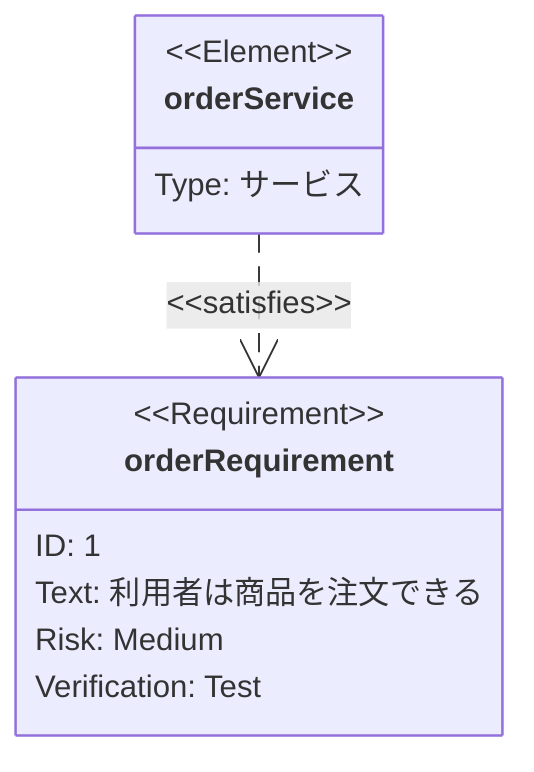

## フローチャート

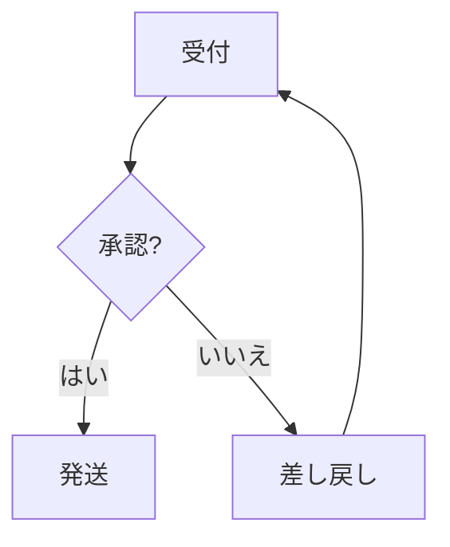

## ノードとエッジ図

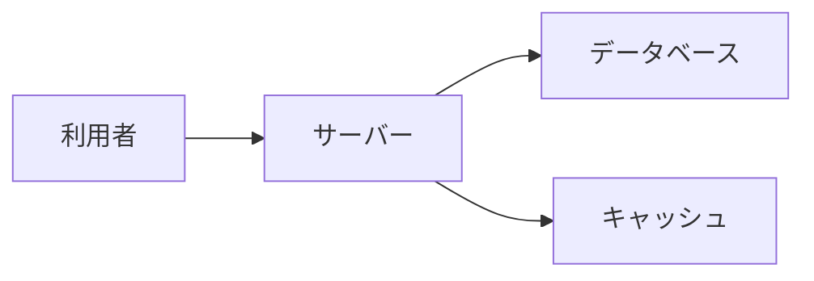

## ER図

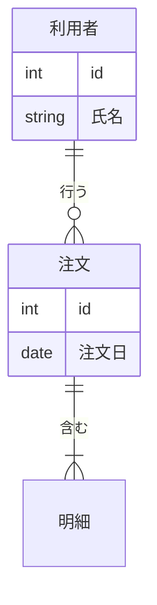

## ガントチャート

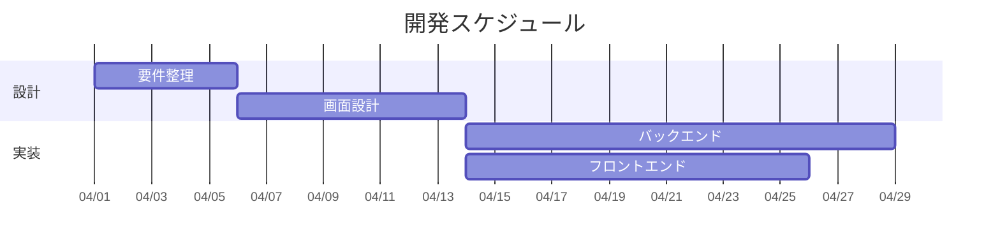

## データ可視化

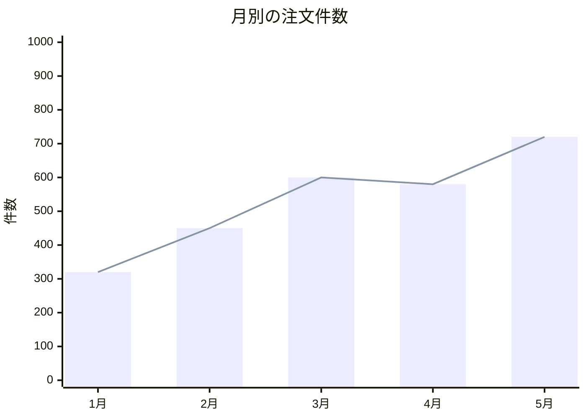

## マインドマップ

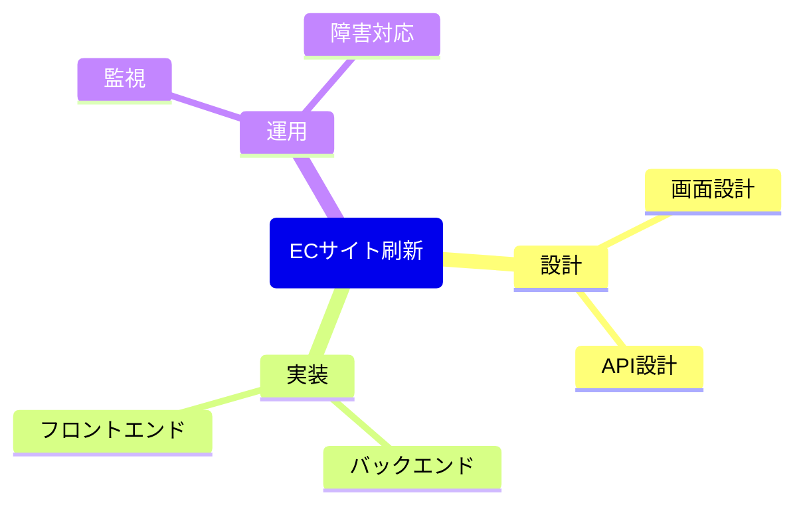

## Git履歴図

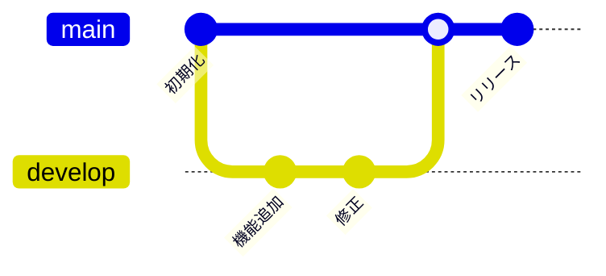

## タイムライン

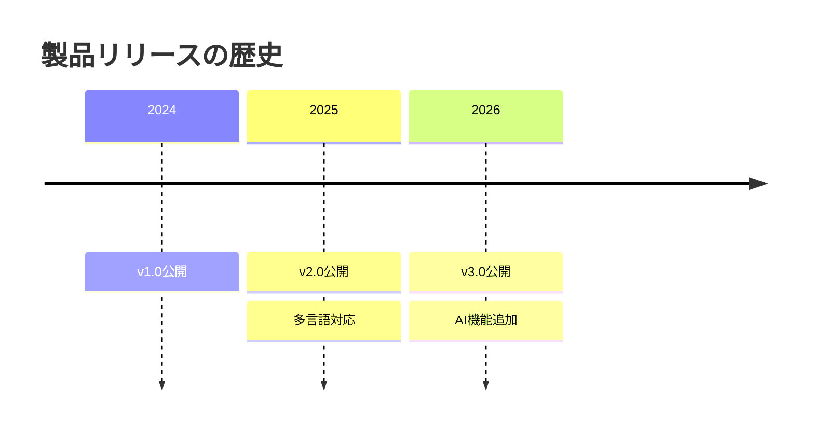

## カンバン

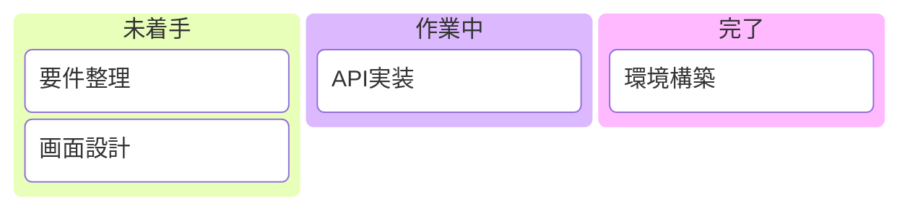

## アーキテクチャ図

`architecture-beta`の`[...]`ラベルは、日本語などの非ASCII文字に対応していません（レクサーのエラーになります。実機確認）。この図だけ、ラベルを英語にしています。

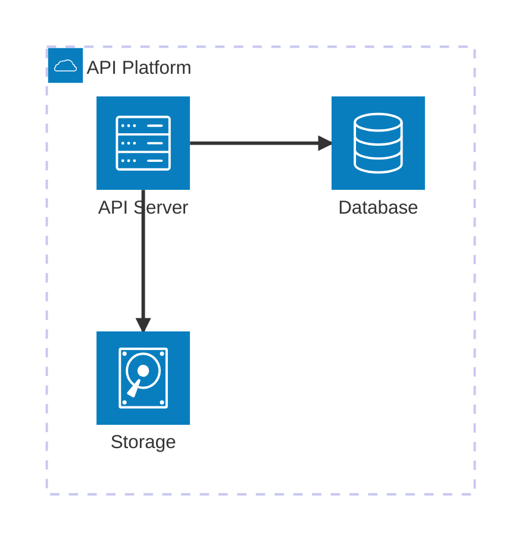

## ポジションマップ（クアドラントチャート）

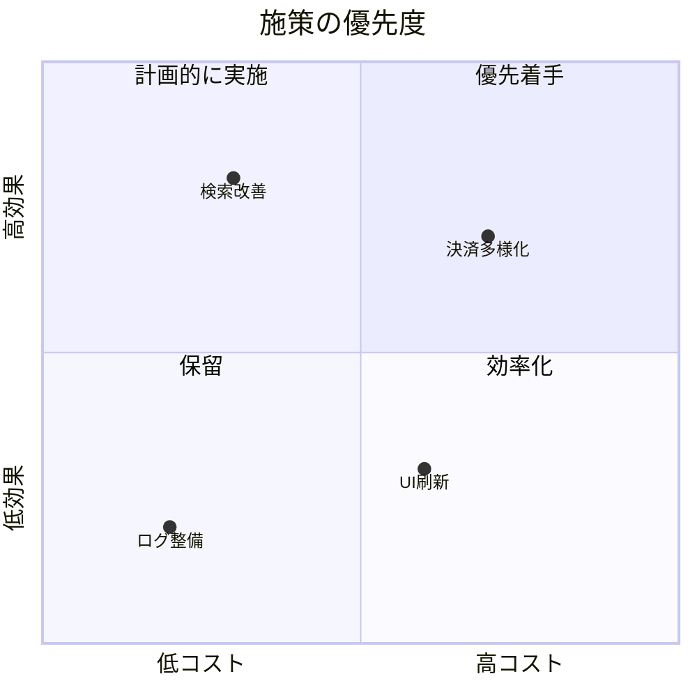

## パケット構造図

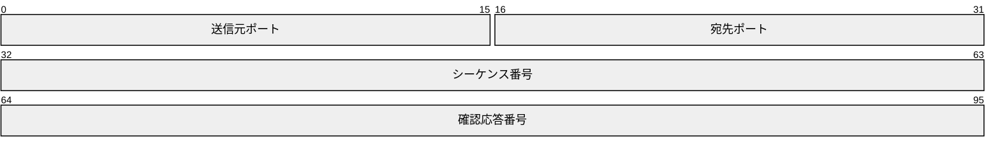
