# PlantUMLのギャラリー

`plantuml`が対応する図の種類の実例です（[#291の対応表](08_diagrams.md#記法で描ける図の種類対応表)）。記法の説明は「図表」の章の「PlantUML固有の注意点」を参照してください。

## シーケンス図

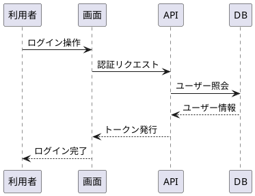

## タイミング図

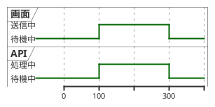

## クラス図

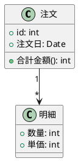

## 状態遷移図

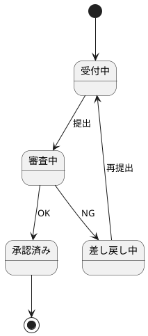

## ユースケース図

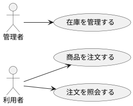

## アクティビティ図

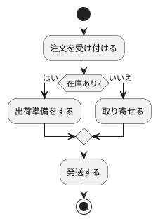

## コンポーネント図／配置図

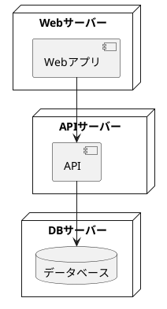

## オブジェクト図

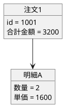

## パッケージ図

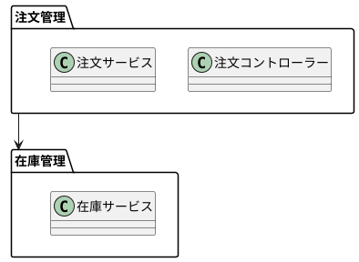

## ガントチャート

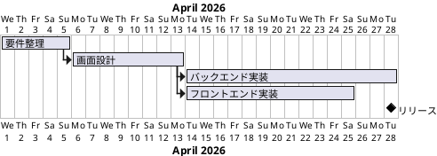

## マインドマップ

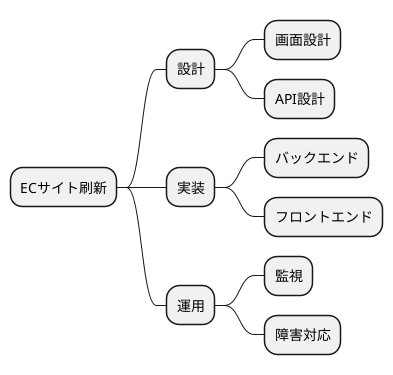
