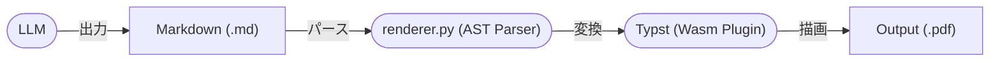
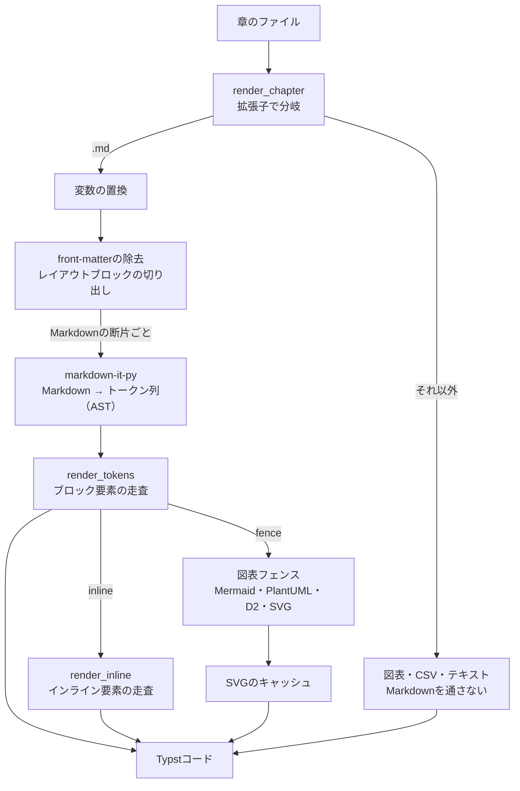

# 6. システムアーキテクチャ

本章ではシステムの全体構成について説明します。
以下の図は、AIが生成したMermaidのアーキテクチャ図であり、ローカルで自動レンダリングされます。

## 6.1 AST Parserの内部構造

AST Parserの実体は、`text_compositor/renderer.py`の`TypstRenderer`です。
Markdownを正規表現で書き換えるのではなく、markdown-it-pyが作るトークン列（AST）を先頭から順にたどり、Typstのコードを出力します。
Markdown以外のファイルは、markdown-it-pyに通さず、拡張子ごとの専用の処理へ渡します。

処理は、次の順に進みます。

1. **入口（`render_chapter`）**: 拡張子で処理を分けます。`.md`以外をmarkdown-it-pyに通さないのは、行頭の`#`や`-`がMarkdownの構文と誤解され、静かに壊れるのを防ぐためです。`.dot`・`.mmd`・`.puml`・`.d2`は図として、`.csv`は表として、それ以外はTypstの`raw()`で等幅表示します。
2. **前処理（`render`）**: 先頭のfront-matterを取り除き、`::: layout-right`などのレイアウトブロックを切り出します。コードフェンスの内側は、対象にしません。2カラム化のように、前後の文と図をまとめて扱う処理は、ASTの流れでは書きにくいため、パースの前に生のテキストで行います。
3. **パース**: 残ったMarkdownの断片を、markdown-it-pyでトークン列にします。CommonMarkに、表・取り消し線・タスクリスト・文字色の属性（`[text]{color=red}`）を加えています。
4. **ブロック要素（`render_tokens`）**: 見出し・段落・引用・リスト・表・水平線・コードフェンス・HTMLを、トークンの種類ごとにTypstへ変換します。GitHub Alert（`> [!NOTE]`）は`callout`になります。`typst-exec`フェンスは、`reviewed/`ディレクトリの配下にあるファイルだけが使えます。
5. **インライン要素（`render_inline`）**: 強調・取り消し線・インラインコード・リンク・画像・文字色・用語集（`[[用語]]`）を変換します。Typstの記号は、ここでエスケープします。
6. **図表フェンス**: `mermaid`・`plantuml`・`d2`は、外部ツールでSVGにしてから、画像として埋め込みます。SVGは、種別・ツールのバージョン・コードから決まるキーでキャッシュし、同じ図は描き直しません。`dot`・`graphviz`は、Typst側のテンプレートが描画します。`svg`は、コードそのものが画像です。
7. **原稿の行への対応づけ**: ブロックの先頭に、元のMarkdownの行番号をコメント（`// @srcmap`）で残します。Typstがエラーを出したときに、Typstコードの行ではなく、原稿の行を示すためです。

このアプローチにより、開発環境へのJavaやNode.jsのインストールを避けたまま、実用的な図表を含むドキュメント生成が可能となります。
