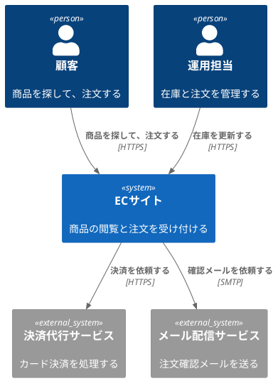

# システムの全体像（System Context）

システムと、その利用者・連携先の関係を示します。内部の作りは見せません。

```plantuml
@startuml
!include <C4/C4_Context>

Person(customer, "顧客", "商品を探して、注文する")
Person(admin, "運用担当", "在庫と注文を管理する")
System(ec, "ECサイト", "商品の閲覧と注文を受け付ける")
System_Ext(pay, "決済代行サービス", "カード決済を処理する")
System_Ext(mail, "メール配信サービス", "注文確認メールを送る")

Rel(customer, ec, "商品を探して、注文する", "HTTPS")
Rel(admin, ec, "在庫を更新する", "HTTPS")
Rel(ec, pay, "決済を依頼する", "HTTPS")
Rel(ec, mail, "確認メールを依頼する", "SMTP")
@enduml
```
