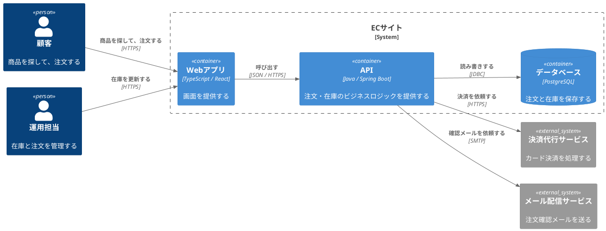

# コンテナ（Container）

ECサイトの中の、動くもの（アプリケーション・データベース）と、その間のやり取りを示します。

```plantuml
@startuml
!include <C4/C4_Container>
LAYOUT_LEFT_RIGHT()

Person(customer, "顧客", "商品を探して、注文する")
Person(admin, "運用担当", "在庫と注文を管理する")

System_Boundary(ec, "ECサイト") {
    Container(web, "Webアプリ", "TypeScript / React", "画面を提供する")
    Container(api, "API", "Java / Spring Boot", "注文・在庫のビジネスロジックを提供する")
    ContainerDb(db, "データベース", "PostgreSQL", "注文と在庫を保存する")
}
System_Ext(pay, "決済代行サービス", "カード決済を処理する")
System_Ext(mail, "メール配信サービス", "注文確認メールを送る")

Rel(customer, web, "商品を探して、注文する", "HTTPS")
Rel(admin, web, "在庫を更新する", "HTTPS")
Rel(web, api, "呼び出す", "JSON / HTTPS")
Rel(api, db, "読み書きする", "JDBC")
Rel(api, pay, "決済を依頼する", "HTTPS")
Rel(api, mail, "確認メールを依頼する", "SMTP")
@enduml
```
