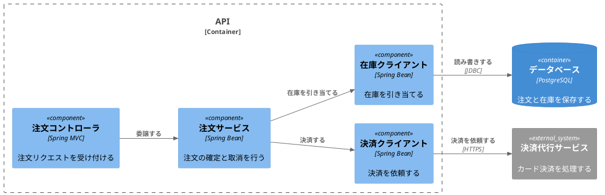

# コンポーネント（Component）

APIの中の、部品と、その関係を示します。

```plantuml
@startuml
!include <C4/C4_Component>
LAYOUT_LEFT_RIGHT()

ContainerDb(db, "データベース", "PostgreSQL", "注文と在庫を保存する")
System_Ext(pay, "決済代行サービス", "カード決済を処理する")

Container_Boundary(api, "API") {
    Component(orderCtl, "注文コントローラ", "Spring MVC", "注文リクエストを受け付ける")
    Component(orderSvc, "注文サービス", "Spring Bean", "注文の確定と取消を行う")
    Component(stockClient, "在庫クライアント", "Spring Bean", "在庫を引き当てる")
    Component(payClient, "決済クライアント", "Spring Bean", "決済を依頼する")
}

Rel(orderCtl, orderSvc, "委譲する")
Rel(orderSvc, stockClient, "在庫を引き当てる")
Rel(orderSvc, payClient, "決済する")
Rel(stockClient, db, "読み書きする", "JDBC")
Rel(payClient, pay, "決済を依頼する", "HTTPS")
@enduml
```
