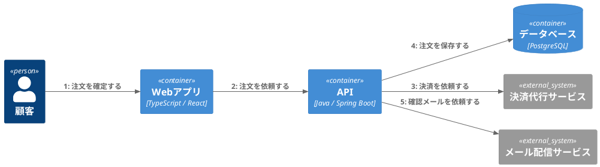

# 注文の流れ（Dynamic）

顧客が注文したときの、実行時のやり取りを、順番に示します。矢印の番号が、順番です。

```plantuml
@startuml
!include <C4/C4_Dynamic>
LAYOUT_LEFT_RIGHT()

Person(customer, "顧客", "")
Container(web, "Webアプリ", "TypeScript / React", "")
Container(api, "API", "Java / Spring Boot", "")
ContainerDb(db, "データベース", "PostgreSQL", "")
System_Ext(pay, "決済代行サービス", "")
System_Ext(mail, "メール配信サービス", "")

Rel(customer, web, "注文を確定する")
Rel(web, api, "注文を依頼する")
Rel(api, pay, "決済を依頼する")
Rel(api, db, "注文を保存する")
Rel(api, mail, "確認メールを依頼する")
@enduml
```
