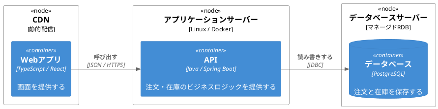

# 配置（Deployment）

本番環境で、各コンテナが、どこで動くかを示します。

```plantuml
@startuml
!include <C4/C4_Deployment>
LAYOUT_LEFT_RIGHT()

Deployment_Node(cdn, "CDN", "静的配信") {
    Container(web, "Webアプリ", "TypeScript / React", "画面を提供する")
}
Deployment_Node(app, "アプリケーションサーバー", "Linux / Docker") {
    Container(api, "API", "Java / Spring Boot", "注文・在庫のビジネスロジックを提供する")
}
Deployment_Node(dbs, "データベースサーバー", "マネージドRDB") {
    ContainerDb(db, "データベース", "PostgreSQL", "注文と在庫を保存する")
}

Rel(web, api, "呼び出す", "JSON / HTTPS")
Rel(api, db, "読み書きする", "JDBC")
@enduml
```
