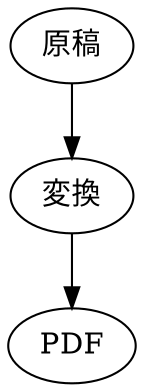

# はじめに

論文や査読レポートは、2段組みで組まれるのが通例である。本稿では、Markdownで書いた原稿を、2段組みのPDFへ変換する`paper`テンプレートを示す。狭い段幅でも、日本語の文章が読みやすく折り返されることを確認する。

## 背景

従来の`template`は、単一段組みで文章を流す。段組みの数は、文書の構造そのものを変えるため、設定の切り替えではなく別のテンプレートとして用意した。

> [!NOTE]
> 見出しは`1`、`1.1`の形式で自動的に番号が付く。章ごとの改ページは行わず、本文は段を続けて流れる。

## 図

Graphvizの図は、段の幅に収まるよう自動的に縮小される。

