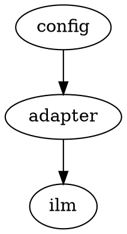

# はじめに

このサンプルは、Typst Universeのテンプレート`ilm`を、アダプタ（`ilm-adapter.typ`）経由で使います。

> [!NOTE]
> 表紙・目次・章の見た目はilmが決めます。本文の記法（表・図・callout）は、通常のテンプレートと同じです。

## 図

## 表

| 項目 | 担当 |
|------|------|
| 表紙・目次 | ilm |
| 章の結合 | text-compositor |
